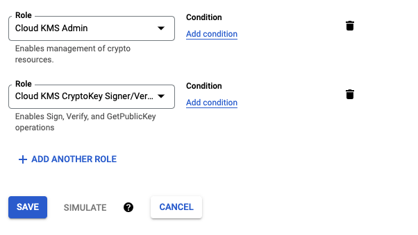

Purpose of this module is to automate some aspects of working with DIDs and VCs using Google Cloud Console.

In order to run these commands you will need a service account with these roles:



These roles have not been minimized and this tooling is not stable.

```

npm run build

npm run transmute -- \
google create did web \
--endpoint "https://example.gov/issuer/123/did.json" \
--serviceAccount "./src/commands/google/google-service-account-key.json" \
--keyRing "google-kms-did-web" \
--project "example-project-name" \
--location "us-west1" \
--output "./data/did-web-google-kms/did.json" \
--debug

```
