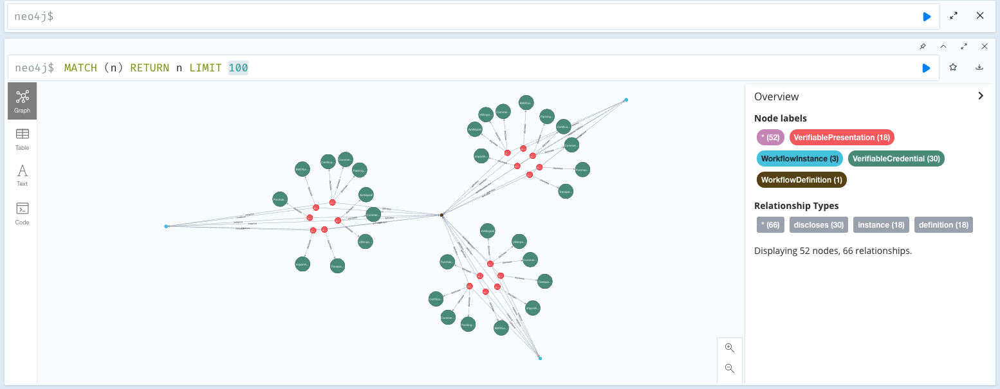

### Build And Run Workflow

```

npm run build

npm run transmute -- \
data create \
--type "WorkflowInstance" \
--input "https://w3id.org/traceability/#e-commerce" \
--variables '{"workflow":{"definition":["123"],"instance":["000"]}}' \
--output "./data/workflows/workflow.instance-0.json"


```

### Import Workflow Instance

Make sure Neo4j is running first, from this directory:

```
docker-compose up
```

```
npm run build

npm run transmute -- \
neo workflow import \
--clean \
--input "./data/workflows/workflow.instance-0.json"

npm run transmute -- \
neo workflow import \
--input "./data/workflows/workflow.instance-1.json"

npm run transmute -- \
neo workflow import \
--input "./data/workflows/workflow.instance-2.json"
```


