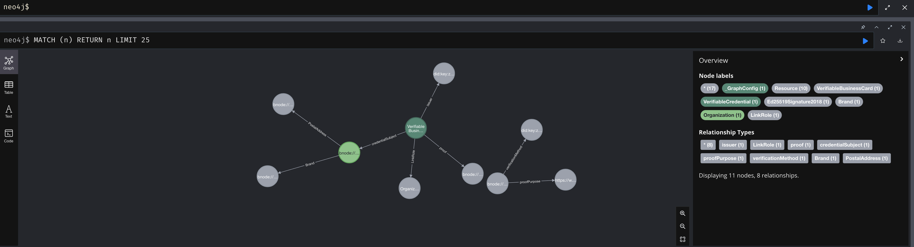

This tutorial teaches the basics of working with neo4j and verifiable data.

Start by downloading Neo4j Desktop and enabling the following plugins:

- APOC
- Neosemantics (n10s)

Next lets use the Neo4j Browser to explore some very simple JSON-LD.

Before we do this, we will need to set some neo4j plugin configuration settings.

```
CALL n10s.graphconfig.init({
    handleVocabUris: 'MAP'
});
```

```
CREATE CONSTRAINT n10s_unique_uri ON (r:Resource)
ASSERT r.uri IS UNIQUE
```

With these 2 changes made to our instance, we can now preview JSON-LD as follows:

```
CALL n10s.rdf.preview.inline(
'
    {
        "@type": "https://schema.org/Organization",
        "https://schema.org/description": "Realigned maximized alliance",
        "https://schema.org/name": "Bartell Inc 🔥"
    }
', 'JSON-LD')
```

This command won't import any data, but it will allow you to view the data, and asses if the properties, labels, and relationships match your expectations.

Next, we'll take a look at some transmute cli commands for working with verifiable data and neo4j.

```
npm run transmute -- \
neo4j import \
--uri "bolt://localhost:7687" \
--user "neo4j" \
--password "test" \
--input "./data/credentials/a.json"
```

If you wish to delete data before importing, use `--force`.

```
npm run transmute -- \
neo4j import \
--uri "bolt://localhost:7687" \
--user "neo4j" \
--password "test" \
--input "./data/credentials/a.json" \
--force
```

You can also import directly via a URL:

```
npm run transmute -- \
neo4j import \
--uri "bolt://localhost:7687" \
--user "neo4j" \
--password "test" \
--input "https://platform.example/credentials/bd8c162e-f08b-4065-92d8-b9b6375d7f9d/framed" \
--force
```

When viewing the data in neo4j browser, you should see:



You can also import a VC-JWT directly like this:

```
npm run transmute -- \
neo4j import \
--uri "bolt://localhost:7687" \
--user "neo4j" \
--password "test" \
--input "eyJhbGciOiJFUzI1NksiLCJraWQiOiJkaWQ6a2V5OnpRM3Nocm5DWnEzUjd2THZEZVdRRm54ejVITUtxUDlKb2lNb256WUpCNFRHWW5mdEwjelEzc2hybkNacTNSN3ZMdkRlV1FGbnh6NUhNS3FQOUpvaU1vbnpZSkI0VEdZbmZ0TCJ9.eyJpc3MiOiJkaWQ6a2V5OnpRM3Nocm5DWnEzUjd2THZEZVdRRm54ejVITUtxUDlKb2lNb256WUpCNFRHWW5mdEwiLCJzdWIiOiJkaWQ6ZXhhbXBsZToxMjMiLCJ2YyI6eyJAY29udGV4dCI6WyJodHRwczovL3d3dy53My5vcmcvMjAxOC9jcmVkZW50aWFscy92MSJdLCJpZCI6InVybjp1dWlkOmEzZmMzNjIyLTdkNDAtNGQzNi1hYzhjLTRhMTU0OWM2NTJmMCIsInR5cGUiOlsiVmVyaWZpYWJsZUNyZWRlbnRpYWwiXSwiaXNzdWVyIjoiZGlkOmtleTp6UTNzaHJuQ1pxM1I3dkx2RGVXUUZueHo1SE1LcVA5Sm9pTW9uellKQjRUR1luZnRMIiwiaXNzdWFuY2VEYXRlIjoiMjAxMC0wMS0wMVQxOToyMzoyNFoiLCJjcmVkZW50aWFsU3ViamVjdCI6eyJpZCI6ImRpZDpleGFtcGxlOjEyMyJ9fSwianRpIjoidXJuOnV1aWQ6YTNmYzM2MjItN2Q0MC00ZDM2LWFjOGMtNGExNTQ5YzY1MmYwIiwibmJmIjoxMjYyMzczODA0fQ.wxepIPIGdcEipAu0rllYhMXh72Wm5blPaNAv9jOaNn1MSMkr-JHMbYO6S3CYk4jxj8Q7wsm6TLgWkBC9gFjNKQ" \
--force
```
