# @transmute/merkle-proof

```
npm i @transmute/merkle-proof --save
```

### Objects

```ts
import merkle from "@transmute/merkle-proof";
const members = ["0", "1", "2", "3", "4", "5", "6", "7"].map(Buffer.from);
const tree = merkle.object.create({ members });
const proof = const proof = merkle.object.reveal({
  proof: tree,
  reveal: [3]
});
const valid = merkle.object.validate({ proof });
const verified = merkle.object.verify({ proof, value: members[3] });
```

```json
{
  "root": "O4KMT0tIxdTLVWKkdOyeL9jVVG-uQOkHMu9jWJLkJyA",
  "paths": [
    "R.a4ayc_80_OGda4BO_1o_V0etpOqiLx1JwB5S3beHW0s~R.qfWzq2Hig1fPzRTitCOX-Jau6o1pmNGebahVhOFQ0rQ~R.AwLJb0Wrvq2yOHgzGpukBgeL0L1dwgLBAq97mYYknwE",
    "L.X-zrZv_IbzjZUnhsbWlsecLbwjndTpG0ZynXOif7V-k~R.qfWzq2Hig1fPzRTitCOX-Jau6o1pmNGebahVhOFQ0rQ~R.AwLJb0Wrvq2yOHgzGpukBgeL0L1dwgLBAq97mYYknwE",
    "R.TgdAhWK-24tgzgXB3s_jrRa3IjCWfeAfZAt-Rym0n84~L.ubEKG8d9KiQdEgMk2387gbLttn646c8Cr5yV0wMprvU~R.AwLJb0Wrvq2yOHgzGpukBgeL0L1dwgLBAq97mYYknwE",
    "L.1HNeOiZeFu7gP1lxi5tdAwGcB9i2xR-Q2jpmbuwTqzU~L.ubEKG8d9KiQdEgMk2387gbLttn646c8Cr5yV0wMprvU~R.AwLJb0Wrvq2yOHgzGpukBgeL0L1dwgLBAq97mYYknwE",
    "R.7y0SfeN7lCuq0GFF5UsMYZofIjJ7LrvPvsePVWSv450~R.E0hDr3_I8plQseHft8SXUuD3txG0WO6a48XKIgFm1og~L.xHj-rQyJt5VAY4-ETIgZ2aQoF2OvknLH85aHdrYFI0U",
    "L.SyJ3d9TdH8Ycb4hPSGQdArTRIdP9Moywi1Ux_Kzav4o~R.E0hDr3_I8plQseHft8SXUuD3txG0WO6a48XKIgFm1og~L.xHj-rQyJt5VAY4-ETIgZ2aQoF2OvknLH85aHdrYFI0U",
    "R.eQJpm-Qsio5G-7tFAXJlF-hrIsVqGJ92JabaSQgbJFE~L.qr2YcVOcN72p93v0dEDfWlfCpXNqBDh9HDuS3_76R-Q~L.xHj-rQyJt5VAY4-ETIgZ2aQoF2OvknLH85aHdrYFI0U",
    "L.5_bAEXdujbfNMwtUF0_Xb30CFrYSOHpf_PuB5vCRloM~L.qr2YcVOcN72p93v0dEDfWlfCpXNqBDh9HDuS3_76R-Q~L.xHj-rQyJt5VAY4-ETIgZ2aQoF2OvknLH85aHdrYFI0U"
  ],
  "leaves": [
    "X-zrZv_IbzjZUnhsbWlsecLbwjndTpG0ZynXOif7V-k",
    "a4ayc_80_OGda4BO_1o_V0etpOqiLx1JwB5S3beHW0s",
    "1HNeOiZeFu7gP1lxi5tdAwGcB9i2xR-Q2jpmbuwTqzU",
    "TgdAhWK-24tgzgXB3s_jrRa3IjCWfeAfZAt-Rym0n84",
    "SyJ3d9TdH8Ycb4hPSGQdArTRIdP9Moywi1Ux_Kzav4o",
    "7y0SfeN7lCuq0GFF5UsMYZofIjJ7LrvPvsePVWSv450",
    "5_bAEXdujbfNMwtUF0_Xb30CFrYSOHpf_PuB5vCRloM",
    "eQJpm-Qsio5G-7tFAXJlF-hrIsVqGJ92JabaSQgbJFE"
  ]
}
```

```json
{
  "root": "_O7ZptDk-KKRBMb5IChJLNvbspr1Pyo3GsUTjdEpZ5Y",
  "paths": [
    "L.ewLQJ-MF4W9Qegf7vAv9vb573djdvUFz2Y4FmBnc7KY~L.1z8VtbsA1IlT9I3aUA3iDA4idPjLUuMNbUFO2qU7AqM~R.oQtWuqlYedaQf0HaYrsfftMb7O6GtMO8SNpTSF1wKFQ"
  ],
  "leaves": [
    "YMsWof5deBcACWaDH51SaAPuvetpCV4Wv0npthB9KQs"
  ],
  "salts": [
    "R-pwzwiHK9tK-tNDKwHZY6x9Fl9rV1zXLvR0mPRFmpA"
  ]
}
```

### URNs

```ts
import merkle from "@transmute/merkle-proof";
const members = ["0", "1", "2", "3", "4", "5", "6", "7"].map(Buffer.from);
const tree = merkle.urn.create({ members });
const proof = merkle.urn.reveal({
  urn: tree,
  reveal: [3]
});
const valid = merkle.urn.validate({ urn: tree });
const verified = merkle.urn.verify({ urn: proof, value: members[3] });
```

```
urn:merkle:_O7ZptDk-KKRBMb5IChJLNvbspr1Pyo3GsUTjdEpZ5Y?B578USAhSWeh7OB1b02pTQA8jlEJVKpCKrsMuKkVgDM.WpNu4ZoM88cNjLAAYRG3pS9F7AFwPgr4zcjG2BrFhQw=R.pciCJqqefE0tMRHMvBLzkqpDFaJh3VwoNxHaa7QDbfs~R.eX7WGq8vtwdIVf2Lx58lSNSRGd6m3GGC0qIKCzBCcZM~R.oQtWuqlYedaQf0HaYrsfftMb7O6GtMO8SNpTSF1wKFQ&pciCJqqefE0tMRHMvBLzkqpDFaJh3VwoNxHaa7QDbfs.kekkD0FSI5gu3DRVMmMHEOlKf1LNX0j17hr8VVB48Ks=L.B578USAhSWeh7OB1b02pTQA8jlEJVKpCKrsMuKkVgDM~R.eX7WGq8vtwdIVf2Lx58lSNSRGd6m3GGC0qIKCzBCcZM~R.oQtWuqlYedaQf0HaYrsfftMb7O6GtMO8SNpTSF1wKFQ&ewLQJ-MF4W9Qegf7vAv9vb573djdvUFz2Y4FmBnc7KY.hymMwvMfunMYHqKp5u8Q3OIe2V6YvaycThUE6hb0huQ=R.YMsWof5deBcACWaDH51SaAPuvetpCV4Wv0npthB9KQs~L.1z8VtbsA1IlT9I3aUA3iDA4idPjLUuMNbUFO2qU7AqM~R.oQtWuqlYedaQf0HaYrsfftMb7O6GtMO8SNpTSF1wKFQ&YMsWof5deBcACWaDH51SaAPuvetpCV4Wv0npthB9KQs.R-pwzwiHK9tK-tNDKwHZY6x9Fl9rV1zXLvR0mPRFmpA=L.ewLQJ-MF4W9Qegf7vAv9vb573djdvUFz2Y4FmBnc7KY~L.1z8VtbsA1IlT9I3aUA3iDA4idPjLUuMNbUFO2qU7AqM~R.oQtWuqlYedaQf0HaYrsfftMb7O6GtMO8SNpTSF1wKFQ&iXvw0qV1d2tMiN8_7Btkbiufs_VDzR56BBV5GtwA3rc.42GlenQGre5lPx3P9mDYTwyjApB3R68qOH9nghrPzjM=R.ZCe4exZwVMPfdWpSvuoAutu1UIABUvSa7vM7nAwa5h4~R.ymgzM-AaNOIiJ_U_hfPmcD8W19iTJoKhU1D71wJonXs~L.J_R8UsFrhydO_FMCDSM6HYl7AycNw4Z3gTAOYRA4C1Q&ZCe4exZwVMPfdWpSvuoAutu1UIABUvSa7vM7nAwa5h4.jf6C2acq2DHkjlJKOK0RHyBu8Iw5qlhH2ybfA07jtX0=L.iXvw0qV1d2tMiN8_7Btkbiufs_VDzR56BBV5GtwA3rc~R.ymgzM-AaNOIiJ_U_hfPmcD8W19iTJoKhU1D71wJonXs~L.J_R8UsFrhydO_FMCDSM6HYl7AycNw4Z3gTAOYRA4C1Q&Uqoj5mowSWBXmIliElD7-UXfsyMCKCqeCk53BWshQ64.GWNzMQgnZpy1j0xojrJ6q8QOYA3JhhW9Mp9BCrdDDP8=R.ICy2ade6u7B_ckUNGDKam7NvRYnBy0-ixCzzW41bous~L.ejZAcfEB2t5sJab2288ELQ0aPugmjTRsd4ZgAaNUR08~L.J_R8UsFrhydO_FMCDSM6HYl7AycNw4Z3gTAOYRA4C1Q&ICy2ade6u7B_ckUNGDKam7NvRYnBy0-ixCzzW41bous.XZ2tFnCTciAJCO7LamdUG6QBO_dJDMtA2LdYMqG0rKA=L.Uqoj5mowSWBXmIliElD7-UXfsyMCKCqeCk53BWshQ64~L.ejZAcfEB2t5sJab2288ELQ0aPugmjTRsd4ZgAaNUR08~L.J_R8UsFrhydO_FMCDSM6HYl7AycNw4Z3gTAOYRA4C1Q
```

```
urn:merkle:_O7ZptDk-KKRBMb5IChJLNvbspr1Pyo3GsUTjdEpZ5Y?YMsWof5deBcACWaDH51SaAPuvetpCV4Wv0npthB9KQs.R-pwzwiHK9tK-tNDKwHZY6x9Fl9rV1zXLvR0mPRFmpA=L.ewLQJ-MF4W9Qegf7vAv9vb573djdvUFz2Y4FmBnc7KY~L.1z8VtbsA1IlT9I3aUA3iDA4idPjLUuMNbUFO2qU7AqM~R.oQtWuqlYedaQf0HaYrsfftMb7O6GtMO8SNpTSF1wKFQ
```

### Mermaid

```ts
import merkle from "@transmute/merkle-proof";
const seed = Buffer.from("hello");
const members = ["0", "1", "2", "3", "4", "5", "6", "7"].map(Buffer.from);
const salts = merkle.salt.from(members, seed);
const urnTree = merkle.urn.create({ members, salts });
const mermaid = merkle.mermaid.urn({
  urn: urnTree,
  value: members[3],
  salt: salts[3]
});
```




```mermaid
%%{
  init: {
    'flowchart': { 'curve': 'monotoneX' },
    'theme': 'base',
    'themeVariables': {
      'primaryColor': '#2a2d4c',
      'primaryTextColor': '#565a7c',
      'nodeBorder': '#565a7c',
      'edgeLabelBackground': '#2a2d4c',
      'clusterBkg': '#2a2d4c',
      'clusterBorder': '#2a2d4c',
      'lineColor': '#565a7c',
      'fontFamily': 'monospace',
      'darkmode': true
    }
  }
}%%
%% Support https://transmute.industries
graph LR
	subgraph Merkle Tree
		direction LR
		fceed9a6d0e4f8a29104c6f92028492cdbdbb29af53f2a371ac5138dd1296796("_O7ZptDk-KKRBMb5IChJLNvbspr1Pyo3GsUTjdEpZ5Y") 
		079efc5120214967a1ece0756f4da94d003c8e510954aa422abb0cb8a9158033("B578USAhSWeh7OB1b02pTQA8jlEJVKpCKrsMuKkVgDM") 
		a5c88226aa9e7c4d2d3111ccbc12f392aa4315a261dd5c283711da6bb4036dfb("pciCJqqefE0tMRHMvBLzkqpDFaJh3VwoNxHaa7QDbfs") 
		797ed61aaf2fb7074855fd8bc79f2548d49119dea6dc6182d2a20a0b30427193("eX7WGq8vtwdIVf2Lx58lSNSRGd6m3GGC0qIKCzBCcZM") 
		a10b56baa95879d6907f41da62bb1f7ed31becee86b4c3bc48da53485d702854("oQtWuqlYedaQf0HaYrsfftMb7O6GtMO8SNpTSF1wKFQ") 
		7b02d027e305e16f507a07fbbc0bfdbdbe7bddd8ddbd4173d98e059819dceca6("ewLQJ-MF4W9Qegf7vAv9vb573djdvUFz2Y4FmBnc7KY") 
		60cb16a1fe5d7817000966831f9d526803eebdeb69095e16bf49e9b6107d290b("YMsWof5deBcACWaDH51SaAPuvetpCV4Wv0npthB9KQs") 
		d73f15b5bb00d48953f48dda500de20c0e2274f8cb52e30d6d414edaa53b02a3("1z8VtbsA1IlT9I3aUA3iDA4idPjLUuMNbUFO2qU7AqM") 
		897bf0d2a575776b4c88df3fec1b646e2b9fb3f543cd1e7a0415791adc00deb7("iXvw0qV1d2tMiN8_7Btkbiufs_VDzR56BBV5GtwA3rc") 
		6427b87b167054c3df756a52beea00badbb550800152f49aeef33b9c0c1ae61e("ZCe4exZwVMPfdWpSvuoAutu1UIABUvSa7vM7nAwa5h4") 
		ca683333e01a34e22227f53f85f3e6703f16d7d8932682a15350fbd702689d7b("ymgzM-AaNOIiJ_U_hfPmcD8W19iTJoKhU1D71wJonXs") 
		27f47c52c16b87274efc53020d233a1d897b03270dc3867781300e6110380b54("J_R8UsFrhydO_FMCDSM6HYl7AycNw4Z3gTAOYRA4C1Q") 
		52aa23e66a304960579889621250fbf945dfb32302282a9e0a4e77056b2143ae("Uqoj5mowSWBXmIliElD7-UXfsyMCKCqeCk53BWshQ64") 
		202cb669d7babbb07f72450d18329a9bb36f4589c1cb4fa2c42cf35b8d5ba2eb("ICy2ade6u7B_ckUNGDKam7NvRYnBy0-ixCzzW41bous") 
		7a364071f101dade6c25a6f6dbcf042d0d1a3ee8268d346c77866001a354474f("ejZAcfEB2t5sJab2288ELQ0aPugmjTRsd4ZgAaNUR08") 
		079efc5120214967a1ece0756f4da94d003c8e510954aa422abb0cb8a9158033 -- right --> a5c88226aa9e7c4d2d3111ccbc12f392aa4315a261dd5c283711da6bb4036dfb
		a5c88226aa9e7c4d2d3111ccbc12f392aa4315a261dd5c283711da6bb4036dfb -- right --> 797ed61aaf2fb7074855fd8bc79f2548d49119dea6dc6182d2a20a0b30427193
		797ed61aaf2fb7074855fd8bc79f2548d49119dea6dc6182d2a20a0b30427193 -- right --> a10b56baa95879d6907f41da62bb1f7ed31becee86b4c3bc48da53485d702854
		a10b56baa95879d6907f41da62bb1f7ed31becee86b4c3bc48da53485d702854 -- proof --> fceed9a6d0e4f8a29104c6f92028492cdbdbb29af53f2a371ac5138dd1296796
		7b02d027e305e16f507a07fbbc0bfdbdbe7bddd8ddbd4173d98e059819dceca6 -- right --> 60cb16a1fe5d7817000966831f9d526803eebdeb69095e16bf49e9b6107d290b
		60cb16a1fe5d7817000966831f9d526803eebdeb69095e16bf49e9b6107d290b -- left --> d73f15b5bb00d48953f48dda500de20c0e2274f8cb52e30d6d414edaa53b02a3
		d73f15b5bb00d48953f48dda500de20c0e2274f8cb52e30d6d414edaa53b02a3 -- right --> a10b56baa95879d6907f41da62bb1f7ed31becee86b4c3bc48da53485d702854
		897bf0d2a575776b4c88df3fec1b646e2b9fb3f543cd1e7a0415791adc00deb7 -- right --> 6427b87b167054c3df756a52beea00badbb550800152f49aeef33b9c0c1ae61e
		6427b87b167054c3df756a52beea00badbb550800152f49aeef33b9c0c1ae61e -- right --> ca683333e01a34e22227f53f85f3e6703f16d7d8932682a15350fbd702689d7b
		ca683333e01a34e22227f53f85f3e6703f16d7d8932682a15350fbd702689d7b -- left --> 27f47c52c16b87274efc53020d233a1d897b03270dc3867781300e6110380b54
		27f47c52c16b87274efc53020d233a1d897b03270dc3867781300e6110380b54 -- proof --> fceed9a6d0e4f8a29104c6f92028492cdbdbb29af53f2a371ac5138dd1296796
		52aa23e66a304960579889621250fbf945dfb32302282a9e0a4e77056b2143ae -- right --> 202cb669d7babbb07f72450d18329a9bb36f4589c1cb4fa2c42cf35b8d5ba2eb
		202cb669d7babbb07f72450d18329a9bb36f4589c1cb4fa2c42cf35b8d5ba2eb -- left --> 7a364071f101dade6c25a6f6dbcf042d0d1a3ee8268d346c77866001a354474f
		7a364071f101dade6c25a6f6dbcf042d0d1a3ee8268d346c77866001a354474f -- left --> 27f47c52c16b87274efc53020d233a1d897b03270dc3867781300e6110380b54
	end
	subgraph Merkle Leaf
		direction LR
		33("Mw...") 
		47ea70cf08872bdb4afad3432b01d963ac7d165f6b575cd72ef47498f4459a90("R-pwzwiHK9tK-tNDKwHZY6x9Fl9rV1zXLvR0mPRFmpA") 
		60cb16a1fe5d7817000966831f9d526803eebdeb69095e16bf49e9b6107d290b("YMsWof5deBcACWaDH51SaAPuvetpCV4Wv0npthB9KQs") 
		33 -- member --> 60cb16a1fe5d7817000966831f9d526803eebdeb69095e16bf49e9b6107d290b
		47ea70cf08872bdb4afad3432b01d963ac7d165f6b575cd72ef47498f4459a90 -- salt --> 60cb16a1fe5d7817000966831f9d526803eebdeb69095e16bf49e9b6107d290b
	end
%% Merkle Tree
style fceed9a6d0e4f8a29104c6f92028492cdbdbb29af53f2a371ac5138dd1296796 color:#fff, fill: #594aa8, stroke:#27225b, stroke-width: 2.0px
style 079efc5120214967a1ece0756f4da94d003c8e510954aa422abb0cb8a9158033 color:#565a7c, stroke:#565a7c, stroke-width: 1.0px
style a5c88226aa9e7c4d2d3111ccbc12f392aa4315a261dd5c283711da6bb4036dfb color:#565a7c, stroke:#565a7c, stroke-width: 1.0px
style 797ed61aaf2fb7074855fd8bc79f2548d49119dea6dc6182d2a20a0b30427193 color:#565a7c, stroke:#565a7c, stroke-width: 1.0px
style a10b56baa95879d6907f41da62bb1f7ed31becee86b4c3bc48da53485d702854 color:#8286a3, stroke:#8286a3, stroke-width: 2.0px
style 7b02d027e305e16f507a07fbbc0bfdbdbe7bddd8ddbd4173d98e059819dceca6 color:#565a7c, stroke:#565a7c, stroke-width: 1.0px
style 60cb16a1fe5d7817000966831f9d526803eebdeb69095e16bf49e9b6107d290b color:#8286a3, stroke:#8286a3, stroke-width: 2.0px
style d73f15b5bb00d48953f48dda500de20c0e2274f8cb52e30d6d414edaa53b02a3 color:#8286a3, stroke:#8286a3, stroke-width: 2.0px
style 897bf0d2a575776b4c88df3fec1b646e2b9fb3f543cd1e7a0415791adc00deb7 color:#565a7c, stroke:#565a7c, stroke-width: 1.0px
style 6427b87b167054c3df756a52beea00badbb550800152f49aeef33b9c0c1ae61e color:#565a7c, stroke:#565a7c, stroke-width: 1.0px
style ca683333e01a34e22227f53f85f3e6703f16d7d8932682a15350fbd702689d7b color:#565a7c, stroke:#565a7c, stroke-width: 1.0px
style 27f47c52c16b87274efc53020d233a1d897b03270dc3867781300e6110380b54 color:#565a7c, stroke:#565a7c, stroke-width: 1.0px
style 52aa23e66a304960579889621250fbf945dfb32302282a9e0a4e77056b2143ae color:#565a7c, stroke:#565a7c, stroke-width: 1.0px
style 202cb669d7babbb07f72450d18329a9bb36f4589c1cb4fa2c42cf35b8d5ba2eb color:#565a7c, stroke:#565a7c, stroke-width: 1.0px
style 7a364071f101dade6c25a6f6dbcf042d0d1a3ee8268d346c77866001a354474f color:#565a7c, stroke:#565a7c, stroke-width: 1.0px
linkStyle 0 color:#565a7c, stroke:#565a7c, stroke-width: 1.0px 
linkStyle 1 color:#565a7c, stroke:#565a7c, stroke-width: 1.0px 
linkStyle 2 color:#565a7c, stroke:#565a7c, stroke-width: 1.0px 
linkStyle 3 color:#fcb373, stroke:#8286a3, stroke-width: 2.0px 
linkStyle 4 color:#565a7c, stroke:#565a7c, stroke-width: 1.0px 
linkStyle 5 color:#ff605d, stroke:#8286a3, stroke-width: 2.0px 
linkStyle 6 color:#ff605d, stroke:#8286a3, stroke-width: 2.0px 
linkStyle 7 color:#565a7c, stroke:#565a7c, stroke-width: 1.0px 
linkStyle 8 color:#565a7c, stroke:#565a7c, stroke-width: 1.0px 
linkStyle 9 color:#565a7c, stroke:#565a7c, stroke-width: 1.0px 
linkStyle 10 color:#565a7c, stroke:#565a7c, stroke-width: 1.0px 
linkStyle 11 color:#565a7c, stroke:#565a7c, stroke-width: 1.0px 
linkStyle 12 color:#565a7c, stroke:#565a7c, stroke-width: 1.0px 
linkStyle 13 color:#565a7c, stroke:#565a7c, stroke-width: 1.0px 
%% Merkle Leaf
style 33 color:#ff605d, stroke:#ff605d, stroke-width: 2.0px
style 47ea70cf08872bdb4afad3432b01d963ac7d165f6b575cd72ef47498f4459a90 color:#fcb373, stroke:#fcb373, stroke-width: 2.0px
style 60cb16a1fe5d7817000966831f9d526803eebdeb69095e16bf49e9b6107d290b color:#fff, fill: #594aa8, stroke:#27225b, stroke-width: 2.0px
linkStyle 14 color:#ff605d, stroke:#8286a3, stroke-width: 2.0px 
linkStyle 15 color:#fcb373, stroke:#8286a3, stroke-width: 2.0px 
```

### Development

```
npm i
npm run lint
npm run test
npm run build
```

### Inspiration

- [settlemint/merkle-tools](https://github.com/settlemint/merkle-tools) - we maintain interop tests with this library.
- [RFC9162 - Certificate Transparency Version 2.0](https://datatracker.ietf.org/doc/html/rfc9162)
- [Certificate Transparency](https://datatracker.ietf.org/doc/html/rfc6962)
- [google/trillian](https://github.com/google/trillian)
- [verkle-trees, and background on k-ary Merkle Trees](https://math.mit.edu/research/highschool/primes/materials/2018/Kuszmaul.pdf)
- [Potential future work: Vector Commitments and their Applications](https://eprint.iacr.org/2011/495.pdf)
