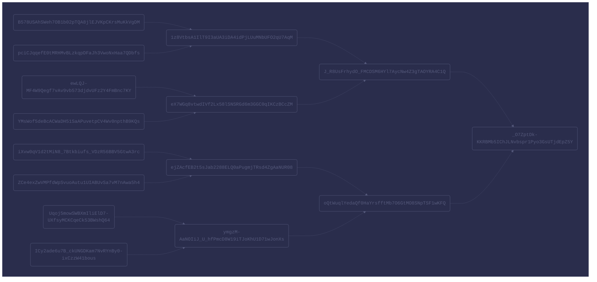

```mermaid
%%{
  init: {
    'flowchart': { 'curve': 'monotoneX' },
    'theme': 'base',
    'themeVariables': {
      'primaryColor': '#2a2d4c',
      'primaryTextColor': '#565a7c',
      'nodeBorder': '#565a7c',
      'edgeLabelBackground': '#2a2d4c',
      'clusterBkg': '#2a2d4c',
      'clusterBorder': '#2a2d4c',
      'lineColor': '#565a7c',
      'fontFamily': 'monospace',
      'darkmode': true
    }
  }
}%%
graph LR
	subgraph &nbsp;
		direction LR
		_O7ZptDk-KKRBMb5IChJLNvbspr1Pyo3GsUTjdEpZ5Y("_O7ZptDk-KKRBMb5IChJLNvbspr1Pyo3GsUTjdEpZ5Y") 
		J_R8UsFrhydO_FMCDSM6HYl7AycNw4Z3gTAOYRA4C1Q("J_R8UsFrhydO_FMCDSM6HYl7AycNw4Z3gTAOYRA4C1Q") 
		oQtWuqlYedaQf0HaYrsfftMb7O6GtMO8SNpTSF1wKFQ("oQtWuqlYedaQf0HaYrsfftMb7O6GtMO8SNpTSF1wKFQ") 
		1z8VtbsA1IlT9I3aUA3iDA4idPjLUuMNbUFO2qU7AqM("1z8VtbsA1IlT9I3aUA3iDA4idPjLUuMNbUFO2qU7AqM") 
		eX7WGq8vtwdIVf2Lx58lSNSRGd6m3GGC0qIKCzBCcZM("eX7WGq8vtwdIVf2Lx58lSNSRGd6m3GGC0qIKCzBCcZM") 
		ejZAcfEB2t5sJab2288ELQ0aPugmjTRsd4ZgAaNUR08("ejZAcfEB2t5sJab2288ELQ0aPugmjTRsd4ZgAaNUR08") 
		ymgzM-AaNOIiJ_U_hfPmcD8W19iTJoKhU1D71wJonXs("ymgzM-AaNOIiJ_U_hfPmcD8W19iTJoKhU1D71wJonXs") 
		B578USAhSWeh7OB1b02pTQA8jlEJVKpCKrsMuKkVgDM("B578USAhSWeh7OB1b02pTQA8jlEJVKpCKrsMuKkVgDM") 
		pciCJqqefE0tMRHMvBLzkqpDFaJh3VwoNxHaa7QDbfs("pciCJqqefE0tMRHMvBLzkqpDFaJh3VwoNxHaa7QDbfs") 
		ewLQJ-MF4W9Qegf7vAv9vb573djdvUFz2Y4FmBnc7KY("ewLQJ-MF4W9Qegf7vAv9vb573djdvUFz2Y4FmBnc7KY") 
		YMsWof5deBcACWaDH51SaAPuvetpCV4Wv0npthB9KQs("YMsWof5deBcACWaDH51SaAPuvetpCV4Wv0npthB9KQs") 
		iXvw0qV1d2tMiN8_7Btkbiufs_VDzR56BBV5GtwA3rc("iXvw0qV1d2tMiN8_7Btkbiufs_VDzR56BBV5GtwA3rc") 
		ZCe4exZwVMPfdWpSvuoAutu1UIABUvSa7vM7nAwa5h4("ZCe4exZwVMPfdWpSvuoAutu1UIABUvSa7vM7nAwa5h4") 
		Uqoj5mowSWBXmIliElD7-UXfsyMCKCqeCk53BWshQ64("Uqoj5mowSWBXmIliElD7-UXfsyMCKCqeCk53BWshQ64") 
		ICy2ade6u7B_ckUNGDKam7NvRYnBy0-ixCzzW41bous("ICy2ade6u7B_ckUNGDKam7NvRYnBy0-ixCzzW41bous") 
		J_R8UsFrhydO_FMCDSM6HYl7AycNw4Z3gTAOYRA4C1Q -.-> _O7ZptDk-KKRBMb5IChJLNvbspr1Pyo3GsUTjdEpZ5Y 
		oQtWuqlYedaQf0HaYrsfftMb7O6GtMO8SNpTSF1wKFQ -.-> _O7ZptDk-KKRBMb5IChJLNvbspr1Pyo3GsUTjdEpZ5Y 
		1z8VtbsA1IlT9I3aUA3iDA4idPjLUuMNbUFO2qU7AqM -.-> J_R8UsFrhydO_FMCDSM6HYl7AycNw4Z3gTAOYRA4C1Q 
		eX7WGq8vtwdIVf2Lx58lSNSRGd6m3GGC0qIKCzBCcZM -.-> J_R8UsFrhydO_FMCDSM6HYl7AycNw4Z3gTAOYRA4C1Q 
		ejZAcfEB2t5sJab2288ELQ0aPugmjTRsd4ZgAaNUR08 -.-> oQtWuqlYedaQf0HaYrsfftMb7O6GtMO8SNpTSF1wKFQ 
		ymgzM-AaNOIiJ_U_hfPmcD8W19iTJoKhU1D71wJonXs -.-> oQtWuqlYedaQf0HaYrsfftMb7O6GtMO8SNpTSF1wKFQ 
		B578USAhSWeh7OB1b02pTQA8jlEJVKpCKrsMuKkVgDM -.-> 1z8VtbsA1IlT9I3aUA3iDA4idPjLUuMNbUFO2qU7AqM 
		pciCJqqefE0tMRHMvBLzkqpDFaJh3VwoNxHaa7QDbfs -.-> 1z8VtbsA1IlT9I3aUA3iDA4idPjLUuMNbUFO2qU7AqM 
		ewLQJ-MF4W9Qegf7vAv9vb573djdvUFz2Y4FmBnc7KY -.-> eX7WGq8vtwdIVf2Lx58lSNSRGd6m3GGC0qIKCzBCcZM 
		YMsWof5deBcACWaDH51SaAPuvetpCV4Wv0npthB9KQs -.-> eX7WGq8vtwdIVf2Lx58lSNSRGd6m3GGC0qIKCzBCcZM 
		iXvw0qV1d2tMiN8_7Btkbiufs_VDzR56BBV5GtwA3rc -.-> ejZAcfEB2t5sJab2288ELQ0aPugmjTRsd4ZgAaNUR08 
		ZCe4exZwVMPfdWpSvuoAutu1UIABUvSa7vM7nAwa5h4 -.-> ejZAcfEB2t5sJab2288ELQ0aPugmjTRsd4ZgAaNUR08 
		Uqoj5mowSWBXmIliElD7-UXfsyMCKCqeCk53BWshQ64 -.-> ymgzM-AaNOIiJ_U_hfPmcD8W19iTJoKhU1D71wJonXs 
		ICy2ade6u7B_ckUNGDKam7NvRYnBy0-ixCzzW41bous -.-> ymgzM-AaNOIiJ_U_hfPmcD8W19iTJoKhU1D71wJonXs 
	end
```