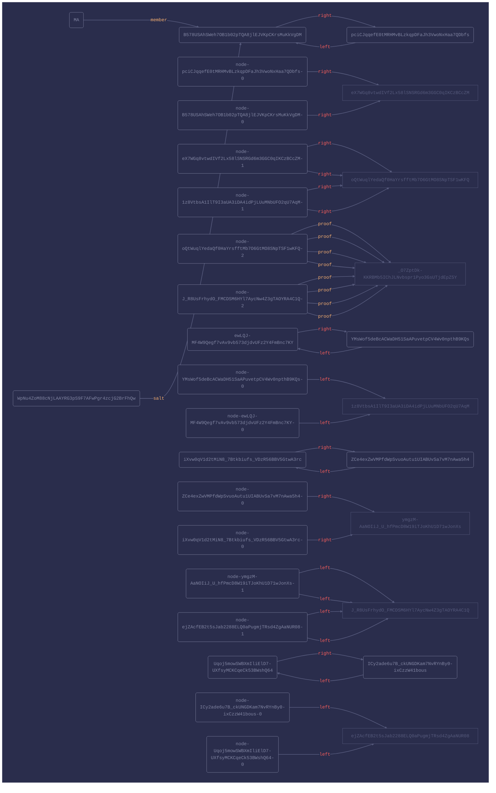

```mermaid
%%{
  init: {
    'flowchart': { 'curve': 'monotoneX' },
    'theme': 'base',
    'themeVariables': {
      'primaryColor': '#2a2d4c',
      'primaryTextColor': '#565a7c',
      'nodeBorder': '#565a7c',
      'edgeLabelBackground': '#2a2d4c',
      'clusterBkg': '#2a2d4c',
      'clusterBorder': '#2a2d4c',
      'lineColor': '#565a7c',
      'fontFamily': 'monospace',
      'darkmode': true
    }
  }
}%%
graph LR
linkStyle default fill:none, stroke-width: 1px, stroke: #565a7c
  subgraph &nbsp;
    direction LR
		B578USAhSWeh7OB1b02pTQA8jlEJVKpCKrsMuKkVgDM("B578USAhSWeh7OB1b02pTQA8jlEJVKpCKrsMuKkVgDM") 
		WpNu4ZoM88cNjLAAYRG3pS9F7AFwPgr4zcjG2BrFhQw("WpNu4ZoM88cNjLAAYRG3pS9F7AFwPgr4zcjG2BrFhQw") 
		MA("MA") 
		B578USAhSWeh7OB1b02pTQA8jlEJVKpCKrsMuKkVgDM("B578USAhSWeh7OB1b02pTQA8jlEJVKpCKrsMuKkVgDM") 
		node-pciCJqqefE0tMRHMvBLzkqpDFaJh3VwoNxHaa7QDbfs-0("node-pciCJqqefE0tMRHMvBLzkqpDFaJh3VwoNxHaa7QDbfs-0") 
		node-eX7WGq8vtwdIVf2Lx58lSNSRGd6m3GGC0qIKCzBCcZM-1("node-eX7WGq8vtwdIVf2Lx58lSNSRGd6m3GGC0qIKCzBCcZM-1") 
		node-oQtWuqlYedaQf0HaYrsfftMb7O6GtMO8SNpTSF1wKFQ-2("node-oQtWuqlYedaQf0HaYrsfftMb7O6GtMO8SNpTSF1wKFQ-2") 
		pciCJqqefE0tMRHMvBLzkqpDFaJh3VwoNxHaa7QDbfs("pciCJqqefE0tMRHMvBLzkqpDFaJh3VwoNxHaa7QDbfs") 
		node-B578USAhSWeh7OB1b02pTQA8jlEJVKpCKrsMuKkVgDM-0("node-B578USAhSWeh7OB1b02pTQA8jlEJVKpCKrsMuKkVgDM-0") 
		node-eX7WGq8vtwdIVf2Lx58lSNSRGd6m3GGC0qIKCzBCcZM-1("node-eX7WGq8vtwdIVf2Lx58lSNSRGd6m3GGC0qIKCzBCcZM-1") 
		node-oQtWuqlYedaQf0HaYrsfftMb7O6GtMO8SNpTSF1wKFQ-2("node-oQtWuqlYedaQf0HaYrsfftMb7O6GtMO8SNpTSF1wKFQ-2") 
		ewLQJ-MF4W9Qegf7vAv9vb573djdvUFz2Y4FmBnc7KY("ewLQJ-MF4W9Qegf7vAv9vb573djdvUFz2Y4FmBnc7KY") 
		node-YMsWof5deBcACWaDH51SaAPuvetpCV4Wv0npthB9KQs-0("node-YMsWof5deBcACWaDH51SaAPuvetpCV4Wv0npthB9KQs-0") 
		node-1z8VtbsA1IlT9I3aUA3iDA4idPjLUuMNbUFO2qU7AqM-1("node-1z8VtbsA1IlT9I3aUA3iDA4idPjLUuMNbUFO2qU7AqM-1") 
		node-oQtWuqlYedaQf0HaYrsfftMb7O6GtMO8SNpTSF1wKFQ-2("node-oQtWuqlYedaQf0HaYrsfftMb7O6GtMO8SNpTSF1wKFQ-2") 
		YMsWof5deBcACWaDH51SaAPuvetpCV4Wv0npthB9KQs("YMsWof5deBcACWaDH51SaAPuvetpCV4Wv0npthB9KQs") 
		node-ewLQJ-MF4W9Qegf7vAv9vb573djdvUFz2Y4FmBnc7KY-0("node-ewLQJ-MF4W9Qegf7vAv9vb573djdvUFz2Y4FmBnc7KY-0") 
		node-1z8VtbsA1IlT9I3aUA3iDA4idPjLUuMNbUFO2qU7AqM-1("node-1z8VtbsA1IlT9I3aUA3iDA4idPjLUuMNbUFO2qU7AqM-1") 
		node-oQtWuqlYedaQf0HaYrsfftMb7O6GtMO8SNpTSF1wKFQ-2("node-oQtWuqlYedaQf0HaYrsfftMb7O6GtMO8SNpTSF1wKFQ-2") 
		iXvw0qV1d2tMiN8_7Btkbiufs_VDzR56BBV5GtwA3rc("iXvw0qV1d2tMiN8_7Btkbiufs_VDzR56BBV5GtwA3rc") 
		node-ZCe4exZwVMPfdWpSvuoAutu1UIABUvSa7vM7nAwa5h4-0("node-ZCe4exZwVMPfdWpSvuoAutu1UIABUvSa7vM7nAwa5h4-0") 
		node-ymgzM-AaNOIiJ_U_hfPmcD8W19iTJoKhU1D71wJonXs-1("node-ymgzM-AaNOIiJ_U_hfPmcD8W19iTJoKhU1D71wJonXs-1") 
		node-J_R8UsFrhydO_FMCDSM6HYl7AycNw4Z3gTAOYRA4C1Q-2("node-J_R8UsFrhydO_FMCDSM6HYl7AycNw4Z3gTAOYRA4C1Q-2") 
		ZCe4exZwVMPfdWpSvuoAutu1UIABUvSa7vM7nAwa5h4("ZCe4exZwVMPfdWpSvuoAutu1UIABUvSa7vM7nAwa5h4") 
		node-iXvw0qV1d2tMiN8_7Btkbiufs_VDzR56BBV5GtwA3rc-0("node-iXvw0qV1d2tMiN8_7Btkbiufs_VDzR56BBV5GtwA3rc-0") 
		node-ymgzM-AaNOIiJ_U_hfPmcD8W19iTJoKhU1D71wJonXs-1("node-ymgzM-AaNOIiJ_U_hfPmcD8W19iTJoKhU1D71wJonXs-1") 
		node-J_R8UsFrhydO_FMCDSM6HYl7AycNw4Z3gTAOYRA4C1Q-2("node-J_R8UsFrhydO_FMCDSM6HYl7AycNw4Z3gTAOYRA4C1Q-2") 
		Uqoj5mowSWBXmIliElD7-UXfsyMCKCqeCk53BWshQ64("Uqoj5mowSWBXmIliElD7-UXfsyMCKCqeCk53BWshQ64") 
		node-ICy2ade6u7B_ckUNGDKam7NvRYnBy0-ixCzzW41bous-0("node-ICy2ade6u7B_ckUNGDKam7NvRYnBy0-ixCzzW41bous-0") 
		node-ejZAcfEB2t5sJab2288ELQ0aPugmjTRsd4ZgAaNUR08-1("node-ejZAcfEB2t5sJab2288ELQ0aPugmjTRsd4ZgAaNUR08-1") 
		node-J_R8UsFrhydO_FMCDSM6HYl7AycNw4Z3gTAOYRA4C1Q-2("node-J_R8UsFrhydO_FMCDSM6HYl7AycNw4Z3gTAOYRA4C1Q-2") 
		ICy2ade6u7B_ckUNGDKam7NvRYnBy0-ixCzzW41bous("ICy2ade6u7B_ckUNGDKam7NvRYnBy0-ixCzzW41bous") 
		node-Uqoj5mowSWBXmIliElD7-UXfsyMCKCqeCk53BWshQ64-0("node-Uqoj5mowSWBXmIliElD7-UXfsyMCKCqeCk53BWshQ64-0") 
		node-ejZAcfEB2t5sJab2288ELQ0aPugmjTRsd4ZgAaNUR08-1("node-ejZAcfEB2t5sJab2288ELQ0aPugmjTRsd4ZgAaNUR08-1") 
		node-J_R8UsFrhydO_FMCDSM6HYl7AycNw4Z3gTAOYRA4C1Q-2("node-J_R8UsFrhydO_FMCDSM6HYl7AycNw4Z3gTAOYRA4C1Q-2") 
		MA -- member --> B578USAhSWeh7OB1b02pTQA8jlEJVKpCKrsMuKkVgDM 
		WpNu4ZoM88cNjLAAYRG3pS9F7AFwPgr4zcjG2BrFhQw -- salt --> B578USAhSWeh7OB1b02pTQA8jlEJVKpCKrsMuKkVgDM 
		B578USAhSWeh7OB1b02pTQA8jlEJVKpCKrsMuKkVgDM -- right --> pciCJqqefE0tMRHMvBLzkqpDFaJh3VwoNxHaa7QDbfs 
		node-pciCJqqefE0tMRHMvBLzkqpDFaJh3VwoNxHaa7QDbfs-0 -- right --> eX7WGq8vtwdIVf2Lx58lSNSRGd6m3GGC0qIKCzBCcZM 
		node-eX7WGq8vtwdIVf2Lx58lSNSRGd6m3GGC0qIKCzBCcZM-1 -- right --> oQtWuqlYedaQf0HaYrsfftMb7O6GtMO8SNpTSF1wKFQ 
		node-oQtWuqlYedaQf0HaYrsfftMb7O6GtMO8SNpTSF1wKFQ-2 -- proof --> _O7ZptDk-KKRBMb5IChJLNvbspr1Pyo3GsUTjdEpZ5Y 
		pciCJqqefE0tMRHMvBLzkqpDFaJh3VwoNxHaa7QDbfs -- left --> B578USAhSWeh7OB1b02pTQA8jlEJVKpCKrsMuKkVgDM 
		node-B578USAhSWeh7OB1b02pTQA8jlEJVKpCKrsMuKkVgDM-0 -- right --> eX7WGq8vtwdIVf2Lx58lSNSRGd6m3GGC0qIKCzBCcZM 
		node-eX7WGq8vtwdIVf2Lx58lSNSRGd6m3GGC0qIKCzBCcZM-1 -- right --> oQtWuqlYedaQf0HaYrsfftMb7O6GtMO8SNpTSF1wKFQ 
		node-oQtWuqlYedaQf0HaYrsfftMb7O6GtMO8SNpTSF1wKFQ-2 -- proof --> _O7ZptDk-KKRBMb5IChJLNvbspr1Pyo3GsUTjdEpZ5Y 
		ewLQJ-MF4W9Qegf7vAv9vb573djdvUFz2Y4FmBnc7KY -- right --> YMsWof5deBcACWaDH51SaAPuvetpCV4Wv0npthB9KQs 
		node-YMsWof5deBcACWaDH51SaAPuvetpCV4Wv0npthB9KQs-0 -- left --> 1z8VtbsA1IlT9I3aUA3iDA4idPjLUuMNbUFO2qU7AqM 
		node-1z8VtbsA1IlT9I3aUA3iDA4idPjLUuMNbUFO2qU7AqM-1 -- right --> oQtWuqlYedaQf0HaYrsfftMb7O6GtMO8SNpTSF1wKFQ 
		node-oQtWuqlYedaQf0HaYrsfftMb7O6GtMO8SNpTSF1wKFQ-2 -- proof --> _O7ZptDk-KKRBMb5IChJLNvbspr1Pyo3GsUTjdEpZ5Y 
		YMsWof5deBcACWaDH51SaAPuvetpCV4Wv0npthB9KQs -- left --> ewLQJ-MF4W9Qegf7vAv9vb573djdvUFz2Y4FmBnc7KY 
		node-ewLQJ-MF4W9Qegf7vAv9vb573djdvUFz2Y4FmBnc7KY-0 -- left --> 1z8VtbsA1IlT9I3aUA3iDA4idPjLUuMNbUFO2qU7AqM 
		node-1z8VtbsA1IlT9I3aUA3iDA4idPjLUuMNbUFO2qU7AqM-1 -- right --> oQtWuqlYedaQf0HaYrsfftMb7O6GtMO8SNpTSF1wKFQ 
		node-oQtWuqlYedaQf0HaYrsfftMb7O6GtMO8SNpTSF1wKFQ-2 -- proof --> _O7ZptDk-KKRBMb5IChJLNvbspr1Pyo3GsUTjdEpZ5Y 
		iXvw0qV1d2tMiN8_7Btkbiufs_VDzR56BBV5GtwA3rc -- right --> ZCe4exZwVMPfdWpSvuoAutu1UIABUvSa7vM7nAwa5h4 
		node-ZCe4exZwVMPfdWpSvuoAutu1UIABUvSa7vM7nAwa5h4-0 -- right --> ymgzM-AaNOIiJ_U_hfPmcD8W19iTJoKhU1D71wJonXs 
		node-ymgzM-AaNOIiJ_U_hfPmcD8W19iTJoKhU1D71wJonXs-1 -- left --> J_R8UsFrhydO_FMCDSM6HYl7AycNw4Z3gTAOYRA4C1Q 
		node-J_R8UsFrhydO_FMCDSM6HYl7AycNw4Z3gTAOYRA4C1Q-2 -- proof --> _O7ZptDk-KKRBMb5IChJLNvbspr1Pyo3GsUTjdEpZ5Y 
		ZCe4exZwVMPfdWpSvuoAutu1UIABUvSa7vM7nAwa5h4 -- left --> iXvw0qV1d2tMiN8_7Btkbiufs_VDzR56BBV5GtwA3rc 
		node-iXvw0qV1d2tMiN8_7Btkbiufs_VDzR56BBV5GtwA3rc-0 -- right --> ymgzM-AaNOIiJ_U_hfPmcD8W19iTJoKhU1D71wJonXs 
		node-ymgzM-AaNOIiJ_U_hfPmcD8W19iTJoKhU1D71wJonXs-1 -- left --> J_R8UsFrhydO_FMCDSM6HYl7AycNw4Z3gTAOYRA4C1Q 
		node-J_R8UsFrhydO_FMCDSM6HYl7AycNw4Z3gTAOYRA4C1Q-2 -- proof --> _O7ZptDk-KKRBMb5IChJLNvbspr1Pyo3GsUTjdEpZ5Y 
		Uqoj5mowSWBXmIliElD7-UXfsyMCKCqeCk53BWshQ64 -- right --> ICy2ade6u7B_ckUNGDKam7NvRYnBy0-ixCzzW41bous 
		node-ICy2ade6u7B_ckUNGDKam7NvRYnBy0-ixCzzW41bous-0 -- left --> ejZAcfEB2t5sJab2288ELQ0aPugmjTRsd4ZgAaNUR08 
		node-ejZAcfEB2t5sJab2288ELQ0aPugmjTRsd4ZgAaNUR08-1 -- left --> J_R8UsFrhydO_FMCDSM6HYl7AycNw4Z3gTAOYRA4C1Q 
		node-J_R8UsFrhydO_FMCDSM6HYl7AycNw4Z3gTAOYRA4C1Q-2 -- proof --> _O7ZptDk-KKRBMb5IChJLNvbspr1Pyo3GsUTjdEpZ5Y 
		ICy2ade6u7B_ckUNGDKam7NvRYnBy0-ixCzzW41bous -- left --> Uqoj5mowSWBXmIliElD7-UXfsyMCKCqeCk53BWshQ64 
		node-Uqoj5mowSWBXmIliElD7-UXfsyMCKCqeCk53BWshQ64-0 -- left --> ejZAcfEB2t5sJab2288ELQ0aPugmjTRsd4ZgAaNUR08 
		node-ejZAcfEB2t5sJab2288ELQ0aPugmjTRsd4ZgAaNUR08-1 -- left --> J_R8UsFrhydO_FMCDSM6HYl7AycNw4Z3gTAOYRA4C1Q 
		node-J_R8UsFrhydO_FMCDSM6HYl7AycNw4Z3gTAOYRA4C1Q-2 -- proof --> _O7ZptDk-KKRBMb5IChJLNvbspr1Pyo3GsUTjdEpZ5Y 
		style B578USAhSWeh7OB1b02pTQA8jlEJVKpCKrsMuKkVgDM color:#8286a3, stroke:#8286a3, stroke-width: 1.0px 
		style WpNu4ZoM88cNjLAAYRG3pS9F7AFwPgr4zcjG2BrFhQw color:#8286a3, stroke:#8286a3, stroke-width: 1.0px 
		style MA color:#8286a3, stroke:#8286a3, stroke-width: 1.0px 
		style B578USAhSWeh7OB1b02pTQA8jlEJVKpCKrsMuKkVgDM color:#8286a3, stroke:#8286a3, stroke-width: 1.0px 
		style node-pciCJqqefE0tMRHMvBLzkqpDFaJh3VwoNxHaa7QDbfs-0 color:#8286a3, stroke:#8286a3, stroke-width: 1.0px 
		style node-eX7WGq8vtwdIVf2Lx58lSNSRGd6m3GGC0qIKCzBCcZM-1 color:#8286a3, stroke:#8286a3, stroke-width: 1.0px 
		style node-oQtWuqlYedaQf0HaYrsfftMb7O6GtMO8SNpTSF1wKFQ-2 color:#8286a3, stroke:#8286a3, stroke-width: 1.0px 
		style pciCJqqefE0tMRHMvBLzkqpDFaJh3VwoNxHaa7QDbfs color:#8286a3, stroke:#8286a3, stroke-width: 1.0px 
		style node-B578USAhSWeh7OB1b02pTQA8jlEJVKpCKrsMuKkVgDM-0 color:#8286a3, stroke:#8286a3, stroke-width: 1.0px 
		style node-eX7WGq8vtwdIVf2Lx58lSNSRGd6m3GGC0qIKCzBCcZM-1 color:#8286a3, stroke:#8286a3, stroke-width: 1.0px 
		style node-oQtWuqlYedaQf0HaYrsfftMb7O6GtMO8SNpTSF1wKFQ-2 color:#8286a3, stroke:#8286a3, stroke-width: 1.0px 
		style ewLQJ-MF4W9Qegf7vAv9vb573djdvUFz2Y4FmBnc7KY color:#8286a3, stroke:#8286a3, stroke-width: 1.0px 
		style node-YMsWof5deBcACWaDH51SaAPuvetpCV4Wv0npthB9KQs-0 color:#8286a3, stroke:#8286a3, stroke-width: 1.0px 
		style node-1z8VtbsA1IlT9I3aUA3iDA4idPjLUuMNbUFO2qU7AqM-1 color:#8286a3, stroke:#8286a3, stroke-width: 1.0px 
		style node-oQtWuqlYedaQf0HaYrsfftMb7O6GtMO8SNpTSF1wKFQ-2 color:#8286a3, stroke:#8286a3, stroke-width: 1.0px 
		style YMsWof5deBcACWaDH51SaAPuvetpCV4Wv0npthB9KQs color:#8286a3, stroke:#8286a3, stroke-width: 1.0px 
		style node-ewLQJ-MF4W9Qegf7vAv9vb573djdvUFz2Y4FmBnc7KY-0 color:#8286a3, stroke:#8286a3, stroke-width: 1.0px 
		style node-1z8VtbsA1IlT9I3aUA3iDA4idPjLUuMNbUFO2qU7AqM-1 color:#8286a3, stroke:#8286a3, stroke-width: 1.0px 
		style node-oQtWuqlYedaQf0HaYrsfftMb7O6GtMO8SNpTSF1wKFQ-2 color:#8286a3, stroke:#8286a3, stroke-width: 1.0px 
		style iXvw0qV1d2tMiN8_7Btkbiufs_VDzR56BBV5GtwA3rc color:#8286a3, stroke:#8286a3, stroke-width: 1.0px 
		style node-ZCe4exZwVMPfdWpSvuoAutu1UIABUvSa7vM7nAwa5h4-0 color:#8286a3, stroke:#8286a3, stroke-width: 1.0px 
		style node-ymgzM-AaNOIiJ_U_hfPmcD8W19iTJoKhU1D71wJonXs-1 color:#8286a3, stroke:#8286a3, stroke-width: 1.0px 
		style node-J_R8UsFrhydO_FMCDSM6HYl7AycNw4Z3gTAOYRA4C1Q-2 color:#8286a3, stroke:#8286a3, stroke-width: 1.0px 
		style ZCe4exZwVMPfdWpSvuoAutu1UIABUvSa7vM7nAwa5h4 color:#8286a3, stroke:#8286a3, stroke-width: 1.0px 
		style node-iXvw0qV1d2tMiN8_7Btkbiufs_VDzR56BBV5GtwA3rc-0 color:#8286a3, stroke:#8286a3, stroke-width: 1.0px 
		style node-ymgzM-AaNOIiJ_U_hfPmcD8W19iTJoKhU1D71wJonXs-1 color:#8286a3, stroke:#8286a3, stroke-width: 1.0px 
		style node-J_R8UsFrhydO_FMCDSM6HYl7AycNw4Z3gTAOYRA4C1Q-2 color:#8286a3, stroke:#8286a3, stroke-width: 1.0px 
		style Uqoj5mowSWBXmIliElD7-UXfsyMCKCqeCk53BWshQ64 color:#8286a3, stroke:#8286a3, stroke-width: 1.0px 
		style node-ICy2ade6u7B_ckUNGDKam7NvRYnBy0-ixCzzW41bous-0 color:#8286a3, stroke:#8286a3, stroke-width: 1.0px 
		style node-ejZAcfEB2t5sJab2288ELQ0aPugmjTRsd4ZgAaNUR08-1 color:#8286a3, stroke:#8286a3, stroke-width: 1.0px 
		style node-J_R8UsFrhydO_FMCDSM6HYl7AycNw4Z3gTAOYRA4C1Q-2 color:#8286a3, stroke:#8286a3, stroke-width: 1.0px 
		style ICy2ade6u7B_ckUNGDKam7NvRYnBy0-ixCzzW41bous color:#8286a3, stroke:#8286a3, stroke-width: 1.0px 
		style node-Uqoj5mowSWBXmIliElD7-UXfsyMCKCqeCk53BWshQ64-0 color:#8286a3, stroke:#8286a3, stroke-width: 1.0px 
		style node-ejZAcfEB2t5sJab2288ELQ0aPugmjTRsd4ZgAaNUR08-1 color:#8286a3, stroke:#8286a3, stroke-width: 1.0px 
		style node-J_R8UsFrhydO_FMCDSM6HYl7AycNw4Z3gTAOYRA4C1Q-2 color:#8286a3, stroke:#8286a3, stroke-width: 1.0px 
		linkStyle 0 color:#fcb373, stroke-width: 2.0px 
		linkStyle 1 color:#fcb373, stroke-width: 2.0px 
		linkStyle 2 color:#ff605d, stroke-width: 2.0px 
		linkStyle 3 color:#ff605d, stroke-width: 2.0px 
		linkStyle 4 color:#ff605d, stroke-width: 2.0px 
		linkStyle 5 color:#fcb373, stroke-width: 2.0px 
		linkStyle 6 color:#ff605d, stroke-width: 2.0px 
		linkStyle 7 color:#ff605d, stroke-width: 2.0px 
		linkStyle 8 color:#ff605d, stroke-width: 2.0px 
		linkStyle 9 color:#fcb373, stroke-width: 2.0px 
		linkStyle 10 color:#ff605d, stroke-width: 2.0px 
		linkStyle 11 color:#ff605d, stroke-width: 2.0px 
		linkStyle 12 color:#ff605d, stroke-width: 2.0px 
		linkStyle 13 color:#fcb373, stroke-width: 2.0px 
		linkStyle 14 color:#ff605d, stroke-width: 2.0px 
		linkStyle 15 color:#ff605d, stroke-width: 2.0px 
		linkStyle 16 color:#ff605d, stroke-width: 2.0px 
		linkStyle 17 color:#fcb373, stroke-width: 2.0px 
		linkStyle 18 color:#ff605d, stroke-width: 2.0px 
		linkStyle 19 color:#ff605d, stroke-width: 2.0px 
		linkStyle 20 color:#ff605d, stroke-width: 2.0px 
		linkStyle 21 color:#fcb373, stroke-width: 2.0px 
		linkStyle 22 color:#ff605d, stroke-width: 2.0px 
		linkStyle 23 color:#ff605d, stroke-width: 2.0px 
		linkStyle 24 color:#ff605d, stroke-width: 2.0px 
		linkStyle 25 color:#fcb373, stroke-width: 2.0px 
		linkStyle 26 color:#ff605d, stroke-width: 2.0px 
		linkStyle 27 color:#ff605d, stroke-width: 2.0px 
		linkStyle 28 color:#ff605d, stroke-width: 2.0px 
		linkStyle 29 color:#fcb373, stroke-width: 2.0px 
		linkStyle 30 color:#ff605d, stroke-width: 2.0px 
		linkStyle 31 color:#ff605d, stroke-width: 2.0px 
		linkStyle 32 color:#ff605d, stroke-width: 2.0px 
		linkStyle 33 color:#fcb373, stroke-width: 2.0px 
  end
```
