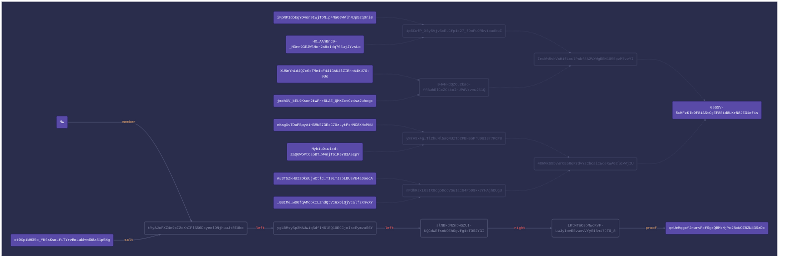

```mermaid
%%{
  init: {
    'flowchart': { 'curve': 'monotoneX' },
    'theme': 'base',
    'themeVariables': {
      'primaryColor': '#2a2d4c',
      'primaryTextColor': '#565a7c',
      'nodeBorder': '#565a7c',
      'edgeLabelBackground': '#2a2d4c',
      'clusterBkg': '#2a2d4c',
      'clusterBorder': '#2a2d4c',
      'lineColor': '#565a7c',
      'fontFamily': 'monospace',
      'darkmode': true
    }
  }
}%%
graph LR
linkStyle default fill:none, stroke-width: 1px, stroke: #565a7c
  subgraph &nbsp;
    direction LR
		d1e49257ee6e305cca95bf45f22012b4e80417c4a277c2caacdf09106d5e7e2b("0eSSV-5uMFzKlb9F8iAStOgEF8Sid8LKrN8JEG1efis") 
		226b96851be155a1e27cbc6eecf6a47fc0365575a0444335d39e69ccceefbd82("ImuWhRvhVaHifLxu7Pakf8A2VXWgREM1055pzM7vvYI") 
		e0e58c906f5bbd6ace11e46a47b76f63609ba1a8885aa7975801b6968c568c85("4OWMkG9bvWrOEeRqR7dvY2CboaiIWqeXWAG2loxWjIU") 
		8a9e82c1f3ff5d2cb9563bf9c442c27e9d5cdbbfdf0e816e39192f8a8b9d6ee2("ip6CwfP_XSy5Vjv5xELCfp1c27_fDoFuORkvioudbuI") 
		d07bc71dd4193aeda46a8f9f7c1c2146509c642e24a089d43dd573be6c36e754("0HvHHdQZOu2kao-ffBwhRlCcZC4koInUPdVzvmw251Q") 
		c8dac0f71e20fd397686e325e5a40d5334e9d8f0474a83eb534535debeca08ff("yNrA9x4g_Tl2huMl5aQNUzTp2PBHSoPrU0U13r7KCP8") 
		9cf76146cc4bd39217f1c8280dc7151ae21a706e0fa03f6493bac70238435205("nPdhRsxL05IX8cgoDccVGuIacG4PoD9kk7rHAjhDUgU") 
		885a4d3f5768120603e289fd2308d30cdfe9e0d6b4e9656584d269e76a8eae2d("iFpNP1doEgYD4on9IwjTDN_p4Na06WVlhNJp52qOri0") 
		1d7fc00260670bdfbf3779a7f461095a51dcaf66bcc4876aef4e6e8c962fb0ba("HX_AAmBnC9-_N3mn9GEJWlHcr2a8xIdq705ujJYvsLo") 
		5d43666212dde10edcd1c4cc7b56c5e38d46014e256480619c0e0a53b3bed14a("XUNmYhLd4Q7c0cTMe1bF441GAU4lZIBhnA4KU7O-0Uo") 
		8e6c615d5fe410bf4ab289f6b5616bafa2c013f40c29972d0b3e2c6b6ba17207("jmxhXV_kEL9Kson2tWFrr6LAE_QMKZctCz4sa2uhcgc") 
		78a6a05ef4c3b8f069c80887e8c584ef71310bbd332f2b4fc47342f171dc30d5("eKagXvTDuPBpyAiH6MWE73ExC70zLytPxHNC8XHcMNU") 
		3726e2bbd8b0d7177e65a43a5a83ed0aca414ff5b89e34fa88ae5807701e1296("Nybiu9iw1xd-ZaQ6WoPtCspBT_W4njT6iK5YB3AeEpY") 
		02edd3e59907508d83928523c02b650bf4f5d0b4c9d9b2c152c544e1a0e879c0("Au3T5ZkHUI2DkoUjwCtlC_T10LTJ2bLBUsVE4aDoecA") 
		fc604831eff03b47ea00c71b9082d985d42d55ceb10e242355c6a57f35e6bd76("_GBIMe_wO0fqAMcbkILZhdQtVc6xDiQjVcalfzXmvXY") 
		root("qnUeMqgxfJnwrvPcfSgeQBMkNjYo28xWOZ8ZN43SzDc") 
		member-0("Mw") 
		salt-0("xt9XpiWH35o_YK6sKsmLfiTYrvBmLukhwdD8a51p5Ng") 
		leaf-0("tYyAJoFXZ4e9xI2dXnIFlS56DcyeelDNjhuuJtREUbc") 
		node-4("ygLBMsySp3MAUwiqSdfIN6lRQ10RCCjoIacEymvuS6Y") 
		node-5("slNBkdMZmbwGZUI-UQCdwEfsnWOEhOgvfg1cTOS2YGI") 
		node-6("LKtMToO8bMwoRvF-LwJyIovREvwxvVYyS1Bmi7JTO_8") 
		226b96851be155a1e27cbc6eecf6a47fc0365575a0444335d39e69ccceefbd82 -.-> d1e49257ee6e305cca95bf45f22012b4e80417c4a277c2caacdf09106d5e7e2b 
		e0e58c906f5bbd6ace11e46a47b76f63609ba1a8885aa7975801b6968c568c85 -.-> d1e49257ee6e305cca95bf45f22012b4e80417c4a277c2caacdf09106d5e7e2b 
		8a9e82c1f3ff5d2cb9563bf9c442c27e9d5cdbbfdf0e816e39192f8a8b9d6ee2 -.-> 226b96851be155a1e27cbc6eecf6a47fc0365575a0444335d39e69ccceefbd82 
		d07bc71dd4193aeda46a8f9f7c1c2146509c642e24a089d43dd573be6c36e754 -.-> 226b96851be155a1e27cbc6eecf6a47fc0365575a0444335d39e69ccceefbd82 
		c8dac0f71e20fd397686e325e5a40d5334e9d8f0474a83eb534535debeca08ff -.-> e0e58c906f5bbd6ace11e46a47b76f63609ba1a8885aa7975801b6968c568c85 
		9cf76146cc4bd39217f1c8280dc7151ae21a706e0fa03f6493bac70238435205 -.-> e0e58c906f5bbd6ace11e46a47b76f63609ba1a8885aa7975801b6968c568c85 
		885a4d3f5768120603e289fd2308d30cdfe9e0d6b4e9656584d269e76a8eae2d -.-> 8a9e82c1f3ff5d2cb9563bf9c442c27e9d5cdbbfdf0e816e39192f8a8b9d6ee2 
		1d7fc00260670bdfbf3779a7f461095a51dcaf66bcc4876aef4e6e8c962fb0ba -.-> 8a9e82c1f3ff5d2cb9563bf9c442c27e9d5cdbbfdf0e816e39192f8a8b9d6ee2 
		5d43666212dde10edcd1c4cc7b56c5e38d46014e256480619c0e0a53b3bed14a -.-> d07bc71dd4193aeda46a8f9f7c1c2146509c642e24a089d43dd573be6c36e754 
		8e6c615d5fe410bf4ab289f6b5616bafa2c013f40c29972d0b3e2c6b6ba17207 -.-> d07bc71dd4193aeda46a8f9f7c1c2146509c642e24a089d43dd573be6c36e754 
		78a6a05ef4c3b8f069c80887e8c584ef71310bbd332f2b4fc47342f171dc30d5 -.-> c8dac0f71e20fd397686e325e5a40d5334e9d8f0474a83eb534535debeca08ff 
		3726e2bbd8b0d7177e65a43a5a83ed0aca414ff5b89e34fa88ae5807701e1296 -.-> c8dac0f71e20fd397686e325e5a40d5334e9d8f0474a83eb534535debeca08ff 
		02edd3e59907508d83928523c02b650bf4f5d0b4c9d9b2c152c544e1a0e879c0 -.-> 9cf76146cc4bd39217f1c8280dc7151ae21a706e0fa03f6493bac70238435205 
		fc604831eff03b47ea00c71b9082d985d42d55ceb10e242355c6a57f35e6bd76 -.-> 9cf76146cc4bd39217f1c8280dc7151ae21a706e0fa03f6493bac70238435205 
		member-0 -- member --> leaf-0 
		salt-0 -- salt --> leaf-0 
		leaf-0 -- left --> node-4 
		node-4 -- left --> node-5 
		node-5 -- right --> node-6 
		node-6 -- proof --> root 
		style d1e49257ee6e305cca95bf45f22012b4e80417c4a277c2caacdf09106d5e7e2b color:#f5f7fd, fill:#594aa8, stroke:#27225b, stroke-width: 2.0px 
		style 226b96851be155a1e27cbc6eecf6a47fc0365575a0444335d39e69ccceefbd82 stroke:#565a7c, stroke-width: 1.0px 
		style e0e58c906f5bbd6ace11e46a47b76f63609ba1a8885aa7975801b6968c568c85 stroke:#565a7c, stroke-width: 1.0px 
		style 8a9e82c1f3ff5d2cb9563bf9c442c27e9d5cdbbfdf0e816e39192f8a8b9d6ee2 stroke:#565a7c, stroke-width: 1.0px 
		style d07bc71dd4193aeda46a8f9f7c1c2146509c642e24a089d43dd573be6c36e754 stroke:#565a7c, stroke-width: 1.0px 
		style c8dac0f71e20fd397686e325e5a40d5334e9d8f0474a83eb534535debeca08ff stroke:#565a7c, stroke-width: 1.0px 
		style 9cf76146cc4bd39217f1c8280dc7151ae21a706e0fa03f6493bac70238435205 stroke:#565a7c, stroke-width: 1.0px 
		style 885a4d3f5768120603e289fd2308d30cdfe9e0d6b4e9656584d269e76a8eae2d color:#f5f7fd, fill:#594aa8, stroke:#27225b, stroke-width: 2.0px 
		style 1d7fc00260670bdfbf3779a7f461095a51dcaf66bcc4876aef4e6e8c962fb0ba color:#f5f7fd, fill:#594aa8, stroke:#27225b, stroke-width: 2.0px 
		style 5d43666212dde10edcd1c4cc7b56c5e38d46014e256480619c0e0a53b3bed14a color:#f5f7fd, fill:#594aa8, stroke:#27225b, stroke-width: 2.0px 
		style 8e6c615d5fe410bf4ab289f6b5616bafa2c013f40c29972d0b3e2c6b6ba17207 color:#f5f7fd, fill:#594aa8, stroke:#27225b, stroke-width: 2.0px 
		style 78a6a05ef4c3b8f069c80887e8c584ef71310bbd332f2b4fc47342f171dc30d5 color:#f5f7fd, fill:#594aa8, stroke:#27225b, stroke-width: 2.0px 
		style 3726e2bbd8b0d7177e65a43a5a83ed0aca414ff5b89e34fa88ae5807701e1296 color:#f5f7fd, fill:#594aa8, stroke:#27225b, stroke-width: 2.0px 
		style 02edd3e59907508d83928523c02b650bf4f5d0b4c9d9b2c152c544e1a0e879c0 color:#f5f7fd, fill:#594aa8, stroke:#27225b, stroke-width: 2.0px 
		style fc604831eff03b47ea00c71b9082d985d42d55ceb10e242355c6a57f35e6bd76 color:#f5f7fd, fill:#594aa8, stroke:#27225b, stroke-width: 2.0px 
		style root color:#f5f7fd, fill:#594aa8, stroke:#27225b, stroke-width: 2.0px 
		style member-0 color:#f5f7fd, fill:#594aa8, stroke:#27225b, stroke-width: 2.0px 
		style salt-0 color:#f5f7fd, fill:#594aa8, stroke:#27225b, stroke-width: 2.0px 
		style leaf-0 color:#8286a3, stroke:#8286a3, stroke-width: 1.0px 
		style node-4 color:#8286a3, stroke:#8286a3, stroke-width: 1.0px 
		style node-5 color:#8286a3, stroke:#8286a3, stroke-width: 1.0px 
		style node-6 color:#8286a3, stroke:#8286a3, stroke-width: 1.0px 
		linkStyle 0 color:#565a7c, stroke:#565a7c, stroke-width: 1.0px 
		linkStyle 1 color:#565a7c, stroke:#565a7c, stroke-width: 1.0px 
		linkStyle 2 color:#565a7c, stroke:#565a7c, stroke-width: 1.0px 
		linkStyle 3 color:#565a7c, stroke:#565a7c, stroke-width: 1.0px 
		linkStyle 4 color:#565a7c, stroke:#565a7c, stroke-width: 1.0px 
		linkStyle 5 color:#565a7c, stroke:#565a7c, stroke-width: 1.0px 
		linkStyle 6 color:#565a7c, stroke:#565a7c, stroke-width: 1.0px 
		linkStyle 7 color:#565a7c, stroke:#565a7c, stroke-width: 1.0px 
		linkStyle 8 color:#565a7c, stroke:#565a7c, stroke-width: 1.0px 
		linkStyle 9 color:#565a7c, stroke:#565a7c, stroke-width: 1.0px 
		linkStyle 10 color:#565a7c, stroke:#565a7c, stroke-width: 1.0px 
		linkStyle 11 color:#565a7c, stroke:#565a7c, stroke-width: 1.0px 
		linkStyle 12 color:#565a7c, stroke:#565a7c, stroke-width: 1.0px 
		linkStyle 13 color:#565a7c, stroke:#565a7c, stroke-width: 1.0px 
		linkStyle 14 color:#fcb373, stroke-width: 2.0px 
		linkStyle 15 color:#fcb373, stroke-width: 2.0px 
		linkStyle 16 color:#ff605d, stroke-width: 2.0px 
		linkStyle 17 color:#ff605d, stroke-width: 2.0px 
		linkStyle 18 color:#ff605d, stroke-width: 2.0px 
		linkStyle 19 color:#fcb373, stroke-width: 2.0px 
  end
```
