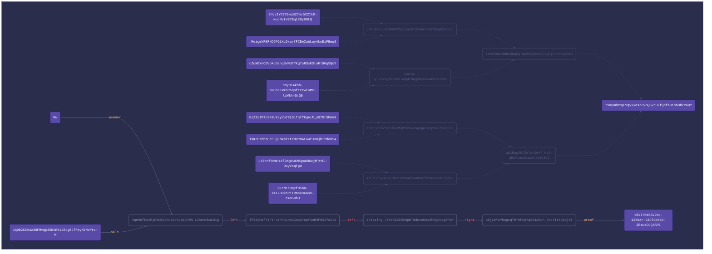

```mermaid
%%{
  init: {
    'flowchart': { 'curve': 'monotoneX' },
    'theme': 'base',
    'themeVariables': {
      'primaryColor': '#2a2d4c',
      'primaryTextColor': '#565a7c',
      'nodeBorder': '#565a7c',
      'edgeLabelBackground': '#2a2d4c',
      'clusterBkg': '#2a2d4c',
      'clusterBorder': '#2a2d4c',
      'lineColor': '#565a7c',
      'fontFamily': 'monospace',
      'darkmode': true
    }
  }
}%%
graph LR
linkStyle default fill:none, stroke-width: 1px, stroke: #565a7c
  subgraph &nbsp;
    direction LR
		eeca3251d06d405f6acb1c5ab19d156d006fac7edf4217dadf586105b60f1ae6("7soyUdBtQF9qyxxasZ0VbQBvrH7fQhfa31hhBbYPGuY") 
		8ad59545b5987666e450da8aa93697f5d214e67b952f7c848c43e91f1a99e22d("itWVRbWYdmbkUNqKqTaX9dIU5nuVL3yEjEPpHxqZ4i0") 
		694d516a0264619abbceb43055ffccb36fa06c2bed59dc4a6b05e6b4ad4dd554("aU1RagJkYZq7zrQwVf_Ms2-gbCvtWdxKawXmtK1N1VQ") 
		ab93a8100c6c79b54637c55f42fc4b69959366ee38bd3b1b148f232841d769da("q5OoEAxsebVGN8VfQvxLaZWTZu44vTsbFI8jKEHXado") 
		c9b6893be0b22713b30f2444294e88baf438d47ba0de673cbe4e011ed1b75d17("ybaJO-CyJxOzDyREKU6IuvQ41Hug3mc8vk4BHtG3XRc") 
		f5b6c4a8ed3d549ceb1e1bb68507fc995c31ea02a05889e1a546b1efbb8f0c8b("9bbEqO09VJzrHhu2hQf8mVwx6gKgWInhpUax77uPDIs") 
		01e1d90e1eb2c2f91524d9182713e8c2113068df5e7c2d2ed143b233c0e5797f("AeHZDh6ywvkVJNkYJxPowhEwaN9efC0u0UOyM8DleX8") 
		d8dbda2183bb67cc2a499ee78a15d92242bec2ea8cbed1c4641ab510dcbd3ad4("2NvaIYO7Z8wqSZ7nihXZIkK-wuqMvtHEZBq1ENy9OtQ") 
		fcc7a282661111134ef4f42d5dc0f1c2b7c5081799b9b2f0c8092e1221419aaf("_MeigmYRERNO9PQtXcDxwrfFCBeZubLwyAkuEiFBmq8") 
		736a8d1189c2d156ca834ce780458d77b60a8136914ac292b682a5f46ab94286("c2qNEYnC0VbKg0zngEWNd7YKgTaRSsKStoKl9Gq5QoY") 
		84dcbc10092187ea110a774b5b39d1eaa19f4f3cf010631efa5896f21e06ac6f("hNy8EAkhh-oRCndLWznR6qGfTzzwEGMe-liW8h4GrG8") 
		12c6597a533b6f9e3c517cf2569efd2ce89f9df4ca800885fe8f7b3abe4f995f("EsZZelM7b548UXzyVp79LOifnfTKgAiF_o97Or5PmV8") 
		97d2993ed9e19f49f92e02cce2caf5b5cf11441004e96b49df48db8b375d6b90("l9KZPtnhn0n5LgLM4sr1tc8RRBAE6WtJ30jbizdda5A") 
		2d8de19dff0c987cf197436046ee8ce606bcf3a72333bafd23e0eec95b2a1605("LY3hnf8MmHzxl0NgRu6M5ga886cjM7r9I-DuyVsqFgU") 
		44b70c4dc1ea09f0d26c7f98035d8e524a0fd5344db15bba68657e700a39f61d("RLcMTcHqCfDSbH-YA12OUkoP1TRNsVu6aGV-cAo59h0") 
		901558ecccc6015f6cabed7791b6abf86e039466e4dd5f99473c1e0cb43800f1("kBVY7MzGAV9sq-13kbar-G4DlGbk3V-ZRzweDLQ4APE") 
		33("Mw") 
		26a0db642100df3dfc147bd0a7848a0112b5241b60f097d17b22843683eb2fe3("JqDbZCEA3z38FHvQp4SKARK1JBtg8JfReyKENoPrL-M") 
		daa9b435f28e5ccc917830439393b3a3dea9f69ea130dfe267c792bdb5824628("2qm0NfKOXMyReDBDk5Ozo96p9p6hMN_iZ8eSvbWCRig") 
		95fdf643069f4f53c8ad5611e0a207a1765a69761ea45de707d3f4d097ddba50("lf32QwafT1PIrVYR4KIHoXZaaXYepF3nB9P00JfdulA") 
		b0a892ce59f2ffb600acae8219103ca4d4fc76ec5e38ecf386443372c8003e9c("sKiSzlny_7YArK6CGRA8pNT8duxeOOzzhkQzcsgAPpw") 
		c418cb798ccff2aaafa9f6dfa0fb1462a019e002aa9ffe28a98218f2af768ca2("xBjLeYzP8qqvqfbfoPsUYqAZ4AKqn_4oqYIY8q92jKI") 
		8ad59545b5987666e450da8aa93697f5d214e67b952f7c848c43e91f1a99e22d -.-> eeca3251d06d405f6acb1c5ab19d156d006fac7edf4217dadf586105b60f1ae6 
		694d516a0264619abbceb43055ffccb36fa06c2bed59dc4a6b05e6b4ad4dd554 -.-> eeca3251d06d405f6acb1c5ab19d156d006fac7edf4217dadf586105b60f1ae6 
		ab93a8100c6c79b54637c55f42fc4b69959366ee38bd3b1b148f232841d769da -.-> 8ad59545b5987666e450da8aa93697f5d214e67b952f7c848c43e91f1a99e22d 
		c9b6893be0b22713b30f2444294e88baf438d47ba0de673cbe4e011ed1b75d17 -.-> 8ad59545b5987666e450da8aa93697f5d214e67b952f7c848c43e91f1a99e22d 
		f5b6c4a8ed3d549ceb1e1bb68507fc995c31ea02a05889e1a546b1efbb8f0c8b -.-> 694d516a0264619abbceb43055ffccb36fa06c2bed59dc4a6b05e6b4ad4dd554 
		01e1d90e1eb2c2f91524d9182713e8c2113068df5e7c2d2ed143b233c0e5797f -.-> 694d516a0264619abbceb43055ffccb36fa06c2bed59dc4a6b05e6b4ad4dd554 
		d8dbda2183bb67cc2a499ee78a15d92242bec2ea8cbed1c4641ab510dcbd3ad4 -.-> ab93a8100c6c79b54637c55f42fc4b69959366ee38bd3b1b148f232841d769da 
		fcc7a282661111134ef4f42d5dc0f1c2b7c5081799b9b2f0c8092e1221419aaf -.-> ab93a8100c6c79b54637c55f42fc4b69959366ee38bd3b1b148f232841d769da 
		736a8d1189c2d156ca834ce780458d77b60a8136914ac292b682a5f46ab94286 -.-> c9b6893be0b22713b30f2444294e88baf438d47ba0de673cbe4e011ed1b75d17 
		84dcbc10092187ea110a774b5b39d1eaa19f4f3cf010631efa5896f21e06ac6f -.-> c9b6893be0b22713b30f2444294e88baf438d47ba0de673cbe4e011ed1b75d17 
		12c6597a533b6f9e3c517cf2569efd2ce89f9df4ca800885fe8f7b3abe4f995f -.-> f5b6c4a8ed3d549ceb1e1bb68507fc995c31ea02a05889e1a546b1efbb8f0c8b 
		97d2993ed9e19f49f92e02cce2caf5b5cf11441004e96b49df48db8b375d6b90 -.-> f5b6c4a8ed3d549ceb1e1bb68507fc995c31ea02a05889e1a546b1efbb8f0c8b 
		2d8de19dff0c987cf197436046ee8ce606bcf3a72333bafd23e0eec95b2a1605 -.-> 01e1d90e1eb2c2f91524d9182713e8c2113068df5e7c2d2ed143b233c0e5797f 
		44b70c4dc1ea09f0d26c7f98035d8e524a0fd5344db15bba68657e700a39f61d -.-> 01e1d90e1eb2c2f91524d9182713e8c2113068df5e7c2d2ed143b233c0e5797f 
		33 -- member --> daa9b435f28e5ccc917830439393b3a3dea9f69ea130dfe267c792bdb5824628 
		26a0db642100df3dfc147bd0a7848a0112b5241b60f097d17b22843683eb2fe3 -- salt --> daa9b435f28e5ccc917830439393b3a3dea9f69ea130dfe267c792bdb5824628 
		daa9b435f28e5ccc917830439393b3a3dea9f69ea130dfe267c792bdb5824628 -- left --> 95fdf643069f4f53c8ad5611e0a207a1765a69761ea45de707d3f4d097ddba50 
		95fdf643069f4f53c8ad5611e0a207a1765a69761ea45de707d3f4d097ddba50 -- left --> b0a892ce59f2ffb600acae8219103ca4d4fc76ec5e38ecf386443372c8003e9c 
		b0a892ce59f2ffb600acae8219103ca4d4fc76ec5e38ecf386443372c8003e9c -- right --> c418cb798ccff2aaafa9f6dfa0fb1462a019e002aa9ffe28a98218f2af768ca2 
		c418cb798ccff2aaafa9f6dfa0fb1462a019e002aa9ffe28a98218f2af768ca2 -- proof --> 901558ecccc6015f6cabed7791b6abf86e039466e4dd5f99473c1e0cb43800f1 
		style eeca3251d06d405f6acb1c5ab19d156d006fac7edf4217dadf586105b60f1ae6 color:#f5f7fd, fill:#594aa8, stroke:#27225b, stroke-width: 2.0px 
		style 8ad59545b5987666e450da8aa93697f5d214e67b952f7c848c43e91f1a99e22d stroke:#565a7c, stroke-width: 1.0px 
		style 694d516a0264619abbceb43055ffccb36fa06c2bed59dc4a6b05e6b4ad4dd554 stroke:#565a7c, stroke-width: 1.0px 
		style ab93a8100c6c79b54637c55f42fc4b69959366ee38bd3b1b148f232841d769da stroke:#565a7c, stroke-width: 1.0px 
		style c9b6893be0b22713b30f2444294e88baf438d47ba0de673cbe4e011ed1b75d17 stroke:#565a7c, stroke-width: 1.0px 
		style f5b6c4a8ed3d549ceb1e1bb68507fc995c31ea02a05889e1a546b1efbb8f0c8b stroke:#565a7c, stroke-width: 1.0px 
		style 01e1d90e1eb2c2f91524d9182713e8c2113068df5e7c2d2ed143b233c0e5797f stroke:#565a7c, stroke-width: 1.0px 
		style d8dbda2183bb67cc2a499ee78a15d92242bec2ea8cbed1c4641ab510dcbd3ad4 color:#f5f7fd, fill:#594aa8, stroke:#27225b, stroke-width: 2.0px 
		style fcc7a282661111134ef4f42d5dc0f1c2b7c5081799b9b2f0c8092e1221419aaf color:#f5f7fd, fill:#594aa8, stroke:#27225b, stroke-width: 2.0px 
		style 736a8d1189c2d156ca834ce780458d77b60a8136914ac292b682a5f46ab94286 color:#f5f7fd, fill:#594aa8, stroke:#27225b, stroke-width: 2.0px 
		style 84dcbc10092187ea110a774b5b39d1eaa19f4f3cf010631efa5896f21e06ac6f color:#f5f7fd, fill:#594aa8, stroke:#27225b, stroke-width: 2.0px 
		style 12c6597a533b6f9e3c517cf2569efd2ce89f9df4ca800885fe8f7b3abe4f995f color:#f5f7fd, fill:#594aa8, stroke:#27225b, stroke-width: 2.0px 
		style 97d2993ed9e19f49f92e02cce2caf5b5cf11441004e96b49df48db8b375d6b90 color:#f5f7fd, fill:#594aa8, stroke:#27225b, stroke-width: 2.0px 
		style 2d8de19dff0c987cf197436046ee8ce606bcf3a72333bafd23e0eec95b2a1605 color:#f5f7fd, fill:#594aa8, stroke:#27225b, stroke-width: 2.0px 
		style 44b70c4dc1ea09f0d26c7f98035d8e524a0fd5344db15bba68657e700a39f61d color:#f5f7fd, fill:#594aa8, stroke:#27225b, stroke-width: 2.0px 
		style 901558ecccc6015f6cabed7791b6abf86e039466e4dd5f99473c1e0cb43800f1 color:#f5f7fd, fill:#594aa8, stroke:#27225b, stroke-width: 2.0px 
		style 33 color:#f5f7fd, fill:#594aa8, stroke:#27225b, stroke-width: 2.0px 
		style 26a0db642100df3dfc147bd0a7848a0112b5241b60f097d17b22843683eb2fe3 color:#f5f7fd, fill:#594aa8, stroke:#27225b, stroke-width: 2.0px 
		style daa9b435f28e5ccc917830439393b3a3dea9f69ea130dfe267c792bdb5824628 color:#8286a3, stroke:#8286a3, stroke-width: 1.0px 
		style 95fdf643069f4f53c8ad5611e0a207a1765a69761ea45de707d3f4d097ddba50 color:#8286a3, stroke:#8286a3, stroke-width: 1.0px 
		style b0a892ce59f2ffb600acae8219103ca4d4fc76ec5e38ecf386443372c8003e9c color:#8286a3, stroke:#8286a3, stroke-width: 1.0px 
		style c418cb798ccff2aaafa9f6dfa0fb1462a019e002aa9ffe28a98218f2af768ca2 color:#8286a3, stroke:#8286a3, stroke-width: 1.0px 
		linkStyle 0 color:#565a7c, stroke:#565a7c, stroke-width: 1.0px 
		linkStyle 1 color:#565a7c, stroke:#565a7c, stroke-width: 1.0px 
		linkStyle 2 color:#565a7c, stroke:#565a7c, stroke-width: 1.0px 
		linkStyle 3 color:#565a7c, stroke:#565a7c, stroke-width: 1.0px 
		linkStyle 4 color:#565a7c, stroke:#565a7c, stroke-width: 1.0px 
		linkStyle 5 color:#565a7c, stroke:#565a7c, stroke-width: 1.0px 
		linkStyle 6 color:#565a7c, stroke:#565a7c, stroke-width: 1.0px 
		linkStyle 7 color:#565a7c, stroke:#565a7c, stroke-width: 1.0px 
		linkStyle 8 color:#565a7c, stroke:#565a7c, stroke-width: 1.0px 
		linkStyle 9 color:#565a7c, stroke:#565a7c, stroke-width: 1.0px 
		linkStyle 10 color:#565a7c, stroke:#565a7c, stroke-width: 1.0px 
		linkStyle 11 color:#565a7c, stroke:#565a7c, stroke-width: 1.0px 
		linkStyle 12 color:#565a7c, stroke:#565a7c, stroke-width: 1.0px 
		linkStyle 13 color:#565a7c, stroke:#565a7c, stroke-width: 1.0px 
		linkStyle 14 color:#fcb373, stroke-width: 2.0px 
		linkStyle 15 color:#fcb373, stroke-width: 2.0px 
		linkStyle 16 color:#ff605d, stroke-width: 2.0px 
		linkStyle 17 color:#ff605d, stroke-width: 2.0px 
		linkStyle 18 color:#ff605d, stroke-width: 2.0px 
		linkStyle 19 color:#fcb373, stroke-width: 2.0px 
  end
```
