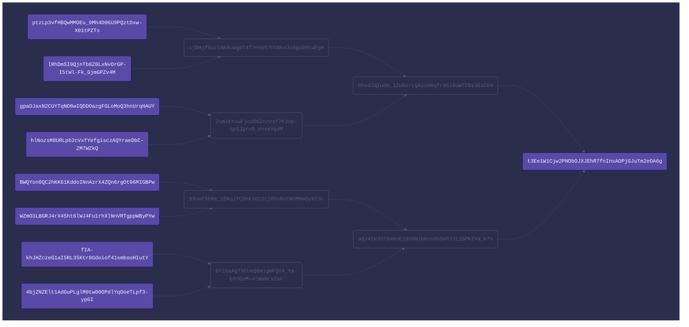

```mermaid
%%{
  init: {
    'flowchart': { 'curve': 'monotoneX' },
    'theme': 'base',
    'themeVariables': {
      'primaryColor': '#2a2d4c',
      'primaryTextColor': '#565a7c',
      'nodeBorder': '#565a7c',
      'edgeLabelBackground': '#2a2d4c',
      'clusterBkg': '#2a2d4c',
      'clusterBorder': '#2a2d4c',
      'lineColor': '#565a7c',
      'fontFamily': 'monospace',
      'darkmode': true
    }
  }
}%%
graph LR
linkStyle default fill:none, stroke-width: 1px, stroke: #565a7c
  subgraph &nbsp;
    direction LR
		b7711ed56d428f0d8f34e6ce257244851edf9c89ec00e3e3189b939b678e03a8("t3Ee1W1Cjw2PNObOJXJEhR7fnInsAOPjGJuTm2eOA6g") 
		3a1c5d26a22ed14ff566e06facb4008b31cda93acde62eae593101b37eac0bce("OhxdJqIu0U_1ZuBvrLQAizHNqTrN5i6uWTEBs36sC84") 
		690278d9e254eddc66b048d21915a26e4a2c1a1e403c9262cc63cad956bf2bbb("aQJ42eJU7dxmsEjSGRWibkosGh5APJJizGPK2Va_K7s") 
		7230e68df56e70800a46ec20765e13ede569e7b579364bc9b3482ef7db701603("cjDmjfVucIAKRuwgdl4T7eVp57V5NkvJs0gu99twFgM") 
		daf989b618b0163a143ba667cd5b1fecadefa7eaa948982b9d1fd59ec7958383("2vmJthiwFjoUO6ZnzVsf7K3vp-qpSJgrnR_VnseVg4M") 
		f57a307f96d19bfd792aa27b083864d46d76723d12bcdb0237930c983ca40897("9Xowf5bRm_15KqJ7CDhk1G12cj0SvNsCN5MMmDykCJc") 
		198d61680813f4251e43a9a2816150578fd86be6fddcecccbc0b5668d2d565a9("GY1haAgT9CUeQ6migWFQV4_Ya-b93OzMvAtWaNLVZak") 
		a6dccba77bdf1c143030c384bbff4c8780f4e94f4f433b4ec70f97d35b4f653b("ptzLp3vfHBQwMMOEu_9Mh4D06U9PQztOxw-X01tPZTs") 
		9518439922344239d36fc67c2f136f3ab18ff88e6d5a5f8593f1a39863d9bf83("lRhDmSI0QjnTb8Z8LxNvOrGP-I5tWl-Fk_GjmGPZv4M") 
		82968325ac4dd825184ea34eeb02100c339ace01462e832843786752ba870146("gpaDJaxN2CUYTqNO6wIQDDOazgFGLoMoQ3hnUrqHAUY") 
		865368cec33c5112e96f6715c5f61e7e08ac73301062b69e0db0be64ced66644("hlNozsM8URLpb2cVxfYefgisczAQYraeDbC-ZM7WZkQ") 
		056418a27d100b684a2bad4a75da08367033ad7e19427eab80eb7de8c20604fc("BWQYon0QC2hKK61KddoINnAzrX4ZQn6rgOt96MIGBPw") 
		59998edcb046449e2b5f8e61b7a95627816ed6b85794d9d5453829a560723d8c("WZmO3LBGRJ4rX45ht6lWJ4Fu1rhXlNnVRTgppWByPYw") 
		7c803e92124765ccde1b5688e512f7e4ab6bf067688a87f8d6c99ba281c8bad6("fIA-khJHZczeG1aI5RL35Ktr8Gdoiof41smbooHIutY") 
		e1b8d9359125b7501d1ae3cb825334b70d3438f76562a3a87932e97f7fb2a462("4bjZNZElt1AdGuPLglM0tw00OPdlYqOoeTLpf3-ypGI") 
		3a1c5d26a22ed14ff566e06facb4008b31cda93acde62eae593101b37eac0bce -.-> b7711ed56d428f0d8f34e6ce257244851edf9c89ec00e3e3189b939b678e03a8 
		690278d9e254eddc66b048d21915a26e4a2c1a1e403c9262cc63cad956bf2bbb -.-> b7711ed56d428f0d8f34e6ce257244851edf9c89ec00e3e3189b939b678e03a8 
		7230e68df56e70800a46ec20765e13ede569e7b579364bc9b3482ef7db701603 -.-> 3a1c5d26a22ed14ff566e06facb4008b31cda93acde62eae593101b37eac0bce 
		daf989b618b0163a143ba667cd5b1fecadefa7eaa948982b9d1fd59ec7958383 -.-> 3a1c5d26a22ed14ff566e06facb4008b31cda93acde62eae593101b37eac0bce 
		f57a307f96d19bfd792aa27b083864d46d76723d12bcdb0237930c983ca40897 -.-> 690278d9e254eddc66b048d21915a26e4a2c1a1e403c9262cc63cad956bf2bbb 
		198d61680813f4251e43a9a2816150578fd86be6fddcecccbc0b5668d2d565a9 -.-> 690278d9e254eddc66b048d21915a26e4a2c1a1e403c9262cc63cad956bf2bbb 
		a6dccba77bdf1c143030c384bbff4c8780f4e94f4f433b4ec70f97d35b4f653b -.-> 7230e68df56e70800a46ec20765e13ede569e7b579364bc9b3482ef7db701603 
		9518439922344239d36fc67c2f136f3ab18ff88e6d5a5f8593f1a39863d9bf83 -.-> 7230e68df56e70800a46ec20765e13ede569e7b579364bc9b3482ef7db701603 
		82968325ac4dd825184ea34eeb02100c339ace01462e832843786752ba870146 -.-> daf989b618b0163a143ba667cd5b1fecadefa7eaa948982b9d1fd59ec7958383 
		865368cec33c5112e96f6715c5f61e7e08ac73301062b69e0db0be64ced66644 -.-> daf989b618b0163a143ba667cd5b1fecadefa7eaa948982b9d1fd59ec7958383 
		056418a27d100b684a2bad4a75da08367033ad7e19427eab80eb7de8c20604fc -.-> f57a307f96d19bfd792aa27b083864d46d76723d12bcdb0237930c983ca40897 
		59998edcb046449e2b5f8e61b7a95627816ed6b85794d9d5453829a560723d8c -.-> f57a307f96d19bfd792aa27b083864d46d76723d12bcdb0237930c983ca40897 
		7c803e92124765ccde1b5688e512f7e4ab6bf067688a87f8d6c99ba281c8bad6 -.-> 198d61680813f4251e43a9a2816150578fd86be6fddcecccbc0b5668d2d565a9 
		e1b8d9359125b7501d1ae3cb825334b70d3438f76562a3a87932e97f7fb2a462 -.-> 198d61680813f4251e43a9a2816150578fd86be6fddcecccbc0b5668d2d565a9 
		style b7711ed56d428f0d8f34e6ce257244851edf9c89ec00e3e3189b939b678e03a8 color:#f5f7fd, fill:#594aa8, stroke:#27225b, stroke-width: 2.0px 
		style 3a1c5d26a22ed14ff566e06facb4008b31cda93acde62eae593101b37eac0bce stroke:#565a7c, stroke-width: 1.0px 
		style 690278d9e254eddc66b048d21915a26e4a2c1a1e403c9262cc63cad956bf2bbb stroke:#565a7c, stroke-width: 1.0px 
		style 7230e68df56e70800a46ec20765e13ede569e7b579364bc9b3482ef7db701603 stroke:#565a7c, stroke-width: 1.0px 
		style daf989b618b0163a143ba667cd5b1fecadefa7eaa948982b9d1fd59ec7958383 stroke:#565a7c, stroke-width: 1.0px 
		style f57a307f96d19bfd792aa27b083864d46d76723d12bcdb0237930c983ca40897 stroke:#565a7c, stroke-width: 1.0px 
		style 198d61680813f4251e43a9a2816150578fd86be6fddcecccbc0b5668d2d565a9 stroke:#565a7c, stroke-width: 1.0px 
		style a6dccba77bdf1c143030c384bbff4c8780f4e94f4f433b4ec70f97d35b4f653b color:#f5f7fd, fill:#594aa8, stroke:#27225b, stroke-width: 2.0px 
		style 9518439922344239d36fc67c2f136f3ab18ff88e6d5a5f8593f1a39863d9bf83 color:#f5f7fd, fill:#594aa8, stroke:#27225b, stroke-width: 2.0px 
		style 82968325ac4dd825184ea34eeb02100c339ace01462e832843786752ba870146 color:#f5f7fd, fill:#594aa8, stroke:#27225b, stroke-width: 2.0px 
		style 865368cec33c5112e96f6715c5f61e7e08ac73301062b69e0db0be64ced66644 color:#f5f7fd, fill:#594aa8, stroke:#27225b, stroke-width: 2.0px 
		style 056418a27d100b684a2bad4a75da08367033ad7e19427eab80eb7de8c20604fc color:#f5f7fd, fill:#594aa8, stroke:#27225b, stroke-width: 2.0px 
		style 59998edcb046449e2b5f8e61b7a95627816ed6b85794d9d5453829a560723d8c color:#f5f7fd, fill:#594aa8, stroke:#27225b, stroke-width: 2.0px 
		style 7c803e92124765ccde1b5688e512f7e4ab6bf067688a87f8d6c99ba281c8bad6 color:#f5f7fd, fill:#594aa8, stroke:#27225b, stroke-width: 2.0px 
		style e1b8d9359125b7501d1ae3cb825334b70d3438f76562a3a87932e97f7fb2a462 color:#f5f7fd, fill:#594aa8, stroke:#27225b, stroke-width: 2.0px 
		linkStyle 0 color:#565a7c, stroke:#565a7c, stroke-width: 1.0px 
		linkStyle 1 color:#565a7c, stroke:#565a7c, stroke-width: 1.0px 
		linkStyle 2 color:#565a7c, stroke:#565a7c, stroke-width: 1.0px 
		linkStyle 3 color:#565a7c, stroke:#565a7c, stroke-width: 1.0px 
		linkStyle 4 color:#565a7c, stroke:#565a7c, stroke-width: 1.0px 
		linkStyle 5 color:#565a7c, stroke:#565a7c, stroke-width: 1.0px 
		linkStyle 6 color:#565a7c, stroke:#565a7c, stroke-width: 1.0px 
		linkStyle 7 color:#565a7c, stroke:#565a7c, stroke-width: 1.0px 
		linkStyle 8 color:#565a7c, stroke:#565a7c, stroke-width: 1.0px 
		linkStyle 9 color:#565a7c, stroke:#565a7c, stroke-width: 1.0px 
		linkStyle 10 color:#565a7c, stroke:#565a7c, stroke-width: 1.0px 
		linkStyle 11 color:#565a7c, stroke:#565a7c, stroke-width: 1.0px 
		linkStyle 12 color:#565a7c, stroke:#565a7c, stroke-width: 1.0px 
		linkStyle 13 color:#565a7c, stroke:#565a7c, stroke-width: 1.0px 
  end
```
