## Merkel Tree URN
```
urn:tmt:bY0iRVbkVrvhTIHUcrYR9YZj6poJReIP4veoaHnxXnw?MA.Ne1SKEZxyZAVsaZ9HbCSt4fkgu3TsGyePO5NpO1dXuQ=R.B9GRR0z1KLqnfRqlXMVUk-OtW2iv9vBy8-qPLBYbgvk~R.ZjrVbpsPM3A6Qnx_SL2ZhKxfOtR1kBeoLk7A-LWD0-o~R.cJy4Qigrk7_gnabGim_TZCxDk_i4SAawO9desIuormg&MQ.opXQIvOIDum6AI0V4GKGFEJHfhlQsWVob-iXOsul9R4=L.6ZdfrTqw1ScfnjahnIs_J39eUE7IQYTrxHhdwgVIFyc~R.ZjrVbpsPM3A6Qnx_SL2ZhKxfOtR1kBeoLk7A-LWD0-o~R.cJy4Qigrk7_gnabGim_TZCxDk_i4SAawO9desIuormg&Mg.tUwrpEhxguSDEF9Lixz4gh7SiC3zvPXEX-huoNqcf_o=R.n6lzTQ6XLD3nMcJlFVksGXzMAGJzGaY4Bf8dio5ZO_0~L.ELLFivaUDXk1LXTyo2EWlVZehWCni9bmkI9VP7r3p1M~R.cJy4Qigrk7_gnabGim_TZCxDk_i4SAawO9desIuormg&Mw.8J8LeDKzC3Jwtq5qLOkVJ74MeQNN3aGKapMdzrgolx4=L.Crs4YtRmEyHhX2CprhBYmG2VdOifO_gSP_Mqf9gjaDc~L.ELLFivaUDXk1LXTyo2EWlVZehWCni9bmkI9VP7r3p1M~R.cJy4Qigrk7_gnabGim_TZCxDk_i4SAawO9desIuormg&NA.g6kjXitnbNNbiYEzUaoSPq-5noUA15lv_4kUdRXX_1Y=R.wawOz3Mk-XGzxaCGKsQYItUtuzx5RLeljDZO3uorQAs~R.bJq9WotcQvUQ24WgRAmJn9RCJ9LXFRNlrTw_QJAjIO4~L.tb3nY0XkXqiMBmCKgffCp3k0c3RUH_yIW8I78G3a-So&NQ.hQICeowoXCj4gfq2_n2OZlNN9EmsKfSNrHrBAqT7AuM=L.mWz8M2QA-tnZhOn5wXkE6jtmkcuLraIS2JnVHvR3xO8~R.bJq9WotcQvUQ24WgRAmJn9RCJ9LXFRNlrTw_QJAjIO4~L.tb3nY0XkXqiMBmCKgffCp3k0c3RUH_yIW8I78G3a-So&Ng.mO6eLG0WpnalOmeSosh8IVXNuz_YAP4egU0ToNS_o2s=R.zA3N7y8ptGQxxMudQ3xU8LliPp-cOMGAGN51HrrV-1Q~L.EhXIbAwLs77u3Bg0ZKj9c4SkQ4z9LPZK1Ucm17JPxJg~L.tb3nY0XkXqiMBmCKgffCp3k0c3RUH_yIW8I78G3a-So&Nw.PgfHoc7XT0XYQG2WG0setrxdrht4UlodM-pQbmzveWw=L.uWau4HnmIC09Rsimjg_9SX7Ey_gXBmFzdL2k2Gb3n8Y~L.EhXIbAwLs77u3Bg0ZKj9c4SkQ4z9LPZK1Ucm17JPxJg~L.tb3nY0XkXqiMBmCKgffCp3k0c3RUH_yIW8I78G3a-So
```

## Merkel Tree Object
```json
{
  "root": "bY0iRVbkVrvhTIHUcrYR9YZj6poJReIP4veoaHnxXnw",
  "members": [
    "MA",
    "MQ",
    "Mg",
    "Mw",
    "NA",
    "NQ",
    "Ng",
    "Nw"
  ],
  "salts": [
    "Ne1SKEZxyZAVsaZ9HbCSt4fkgu3TsGyePO5NpO1dXuQ",
    "opXQIvOIDum6AI0V4GKGFEJHfhlQsWVob-iXOsul9R4",
    "tUwrpEhxguSDEF9Lixz4gh7SiC3zvPXEX-huoNqcf_o",
    "8J8LeDKzC3Jwtq5qLOkVJ74MeQNN3aGKapMdzrgolx4",
    "g6kjXitnbNNbiYEzUaoSPq-5noUA15lv_4kUdRXX_1Y",
    "hQICeowoXCj4gfq2_n2OZlNN9EmsKfSNrHrBAqT7AuM",
    "mO6eLG0WpnalOmeSosh8IVXNuz_YAP4egU0ToNS_o2s",
    "PgfHoc7XT0XYQG2WG0setrxdrht4UlodM-pQbmzveWw"
  ],
  "proofs": [
    "R.B9GRR0z1KLqnfRqlXMVUk-OtW2iv9vBy8-qPLBYbgvk~R.ZjrVbpsPM3A6Qnx_SL2ZhKxfOtR1kBeoLk7A-LWD0-o~R.cJy4Qigrk7_gnabGim_TZCxDk_i4SAawO9desIuormg",
    "L.6ZdfrTqw1ScfnjahnIs_J39eUE7IQYTrxHhdwgVIFyc~R.ZjrVbpsPM3A6Qnx_SL2ZhKxfOtR1kBeoLk7A-LWD0-o~R.cJy4Qigrk7_gnabGim_TZCxDk_i4SAawO9desIuormg",
    "R.n6lzTQ6XLD3nMcJlFVksGXzMAGJzGaY4Bf8dio5ZO_0~L.ELLFivaUDXk1LXTyo2EWlVZehWCni9bmkI9VP7r3p1M~R.cJy4Qigrk7_gnabGim_TZCxDk_i4SAawO9desIuormg",
    "L.Crs4YtRmEyHhX2CprhBYmG2VdOifO_gSP_Mqf9gjaDc~L.ELLFivaUDXk1LXTyo2EWlVZehWCni9bmkI9VP7r3p1M~R.cJy4Qigrk7_gnabGim_TZCxDk_i4SAawO9desIuormg",
    "R.wawOz3Mk-XGzxaCGKsQYItUtuzx5RLeljDZO3uorQAs~R.bJq9WotcQvUQ24WgRAmJn9RCJ9LXFRNlrTw_QJAjIO4~L.tb3nY0XkXqiMBmCKgffCp3k0c3RUH_yIW8I78G3a-So",
    "L.mWz8M2QA-tnZhOn5wXkE6jtmkcuLraIS2JnVHvR3xO8~R.bJq9WotcQvUQ24WgRAmJn9RCJ9LXFRNlrTw_QJAjIO4~L.tb3nY0XkXqiMBmCKgffCp3k0c3RUH_yIW8I78G3a-So",
    "R.zA3N7y8ptGQxxMudQ3xU8LliPp-cOMGAGN51HrrV-1Q~L.EhXIbAwLs77u3Bg0ZKj9c4SkQ4z9LPZK1Ucm17JPxJg~L.tb3nY0XkXqiMBmCKgffCp3k0c3RUH_yIW8I78G3a-So",
    "L.uWau4HnmIC09Rsimjg_9SX7Ey_gXBmFzdL2k2Gb3n8Y~L.EhXIbAwLs77u3Bg0ZKj9c4SkQ4z9LPZK1Ucm17JPxJg~L.tb3nY0XkXqiMBmCKgffCp3k0c3RUH_yIW8I78G3a-So"
  ]
}
```

## Merkel Tree Mermaid

```mermaid
%%{
  init: {
    'flowchart': { 'curve': 'monotoneX' },
    'theme': 'base',
    'themeVariables': {
      'primaryColor': '#2a2d4c',
      'primaryTextColor': '#565a7c',
      'nodeBorder': '#565a7c',
      'edgeLabelBackground': '#2a2d4c',
      'clusterBkg': '#2a2d4c',
      'clusterBorder': '#2a2d4c',
      'lineColor': '#565a7c',
      'fontFamily': 'monospace',
      'darkmode': true
    }
  }
}%%
graph LR
linkStyle default fill:none, stroke-width: 1px, stroke: #565a7c
  subgraph &nbsp;
    direction LR
		d57a9a1e875746ba91a693567761bf616f0c83478688fc448369f45187b33ab7("bY0iRVbkVrvhTIHUcrYR9YZj6poJReIP4veoaHnxXnw") 
		5b833e08a9aa1c37c08a30ed473e70b9033905501dfa5d4f504c76ff9faa9fa0("tb3nY0XkXqiMBmCKgffCp3k0c3RUH_yIW8I78G3a-So") 
		1b834b9480615d9c9b650e1007138d466bedc35b4c9cb401cbf06effbab9c471("cJy4Qigrk7_gnabGim_TZCxDk_i4SAawO9desIuormg") 
		0f16fb4931662a76b8a0fbdd7856a4502616b80b1833a2cc4fc6a3c3a22dde78("ELLFivaUDXk1LXTyo2EWlVZehWCni9bmkI9VP7r3p1M") 
		dbca71c3e371765b06775f4383e85380ea518d2df196cc88d5b132fdd9e56b23("ZjrVbpsPM3A6Qnx_SL2ZhKxfOtR1kBeoLk7A-LWD0-o") 
		3d478150b0ad6077f6244a879b9fce5efcbcead26bbb5c70f05fbacb79d4560e("EhXIbAwLs77u3Bg0ZKj9c4SkQ4z9LPZK1Ucm17JPxJg") 
		91d0215589b45f7a882c43b1fb486fc9d791f95043dbb4d11afe61c3899f8a31("bJq9WotcQvUQ24WgRAmJn9RCJ9LXFRNlrTw_QJAjIO4") 
		667690c8c05cec56ba33dda456f20bb9911145f164542ab5f33c799fc20bb982("6ZdfrTqw1ScfnjahnIs_J39eUE7IQYTrxHhdwgVIFyc") 
		bab21c24a6a7d97c1f37a955476ec59a3ed29f9237f7dfc691a7b16e28b952ff("B9GRR0z1KLqnfRqlXMVUk-OtW2iv9vBy8-qPLBYbgvk") 
		5831519fc393227f96f10d342628a326852522166ba78660568f60ff10c32799("Crs4YtRmEyHhX2CprhBYmG2VdOifO_gSP_Mqf9gjaDc") 
		fcd1a855f74de5745adab9919e6574ea03abc8f3181d1b5aea81f72cbae5886b("n6lzTQ6XLD3nMcJlFVksGXzMAGJzGaY4Bf8dio5ZO_0") 
		1943a1303b8936eddd16d5c85208819149d15efd14b4ef4205d6478d0f443b7b("mWz8M2QA-tnZhOn5wXkE6jtmkcuLraIS2JnVHvR3xO8") 
		584f2921c8e4728ff54b46f81ce10cda19a25561130f14a5c9b4456aff636d28("wawOz3Mk-XGzxaCGKsQYItUtuzx5RLeljDZO3uorQAs") 
		76dc12ca4c7191efd09ae1fe6038fbafda044e1be2824c8c3e8250188eb8f4e0("uWau4HnmIC09Rsimjg_9SX7Ey_gXBmFzdL2k2Gb3n8Y") 
		1eea51f5664f3a30ec8abb65439b3655920a6e1fa4a9ba459722c20522fdf0bf("zA3N7y8ptGQxxMudQ3xU8LliPp-cOMGAGN51HrrV-1Q") 
		5b833e08a9aa1c37c08a30ed473e70b9033905501dfa5d4f504c76ff9faa9fa0 -.-> d57a9a1e875746ba91a693567761bf616f0c83478688fc448369f45187b33ab7 
		1b834b9480615d9c9b650e1007138d466bedc35b4c9cb401cbf06effbab9c471 -.-> d57a9a1e875746ba91a693567761bf616f0c83478688fc448369f45187b33ab7 
		0f16fb4931662a76b8a0fbdd7856a4502616b80b1833a2cc4fc6a3c3a22dde78 -.-> 5b833e08a9aa1c37c08a30ed473e70b9033905501dfa5d4f504c76ff9faa9fa0 
		dbca71c3e371765b06775f4383e85380ea518d2df196cc88d5b132fdd9e56b23 -.-> 5b833e08a9aa1c37c08a30ed473e70b9033905501dfa5d4f504c76ff9faa9fa0 
		3d478150b0ad6077f6244a879b9fce5efcbcead26bbb5c70f05fbacb79d4560e -.-> 1b834b9480615d9c9b650e1007138d466bedc35b4c9cb401cbf06effbab9c471 
		91d0215589b45f7a882c43b1fb486fc9d791f95043dbb4d11afe61c3899f8a31 -.-> 1b834b9480615d9c9b650e1007138d466bedc35b4c9cb401cbf06effbab9c471 
		667690c8c05cec56ba33dda456f20bb9911145f164542ab5f33c799fc20bb982 -.-> 0f16fb4931662a76b8a0fbdd7856a4502616b80b1833a2cc4fc6a3c3a22dde78 
		bab21c24a6a7d97c1f37a955476ec59a3ed29f9237f7dfc691a7b16e28b952ff -.-> 0f16fb4931662a76b8a0fbdd7856a4502616b80b1833a2cc4fc6a3c3a22dde78 
		5831519fc393227f96f10d342628a326852522166ba78660568f60ff10c32799 -.-> dbca71c3e371765b06775f4383e85380ea518d2df196cc88d5b132fdd9e56b23 
		fcd1a855f74de5745adab9919e6574ea03abc8f3181d1b5aea81f72cbae5886b -.-> dbca71c3e371765b06775f4383e85380ea518d2df196cc88d5b132fdd9e56b23 
		1943a1303b8936eddd16d5c85208819149d15efd14b4ef4205d6478d0f443b7b -.-> 3d478150b0ad6077f6244a879b9fce5efcbcead26bbb5c70f05fbacb79d4560e 
		584f2921c8e4728ff54b46f81ce10cda19a25561130f14a5c9b4456aff636d28 -.-> 3d478150b0ad6077f6244a879b9fce5efcbcead26bbb5c70f05fbacb79d4560e 
		76dc12ca4c7191efd09ae1fe6038fbafda044e1be2824c8c3e8250188eb8f4e0 -.-> 91d0215589b45f7a882c43b1fb486fc9d791f95043dbb4d11afe61c3899f8a31 
		1eea51f5664f3a30ec8abb65439b3655920a6e1fa4a9ba459722c20522fdf0bf -.-> 91d0215589b45f7a882c43b1fb486fc9d791f95043dbb4d11afe61c3899f8a31 
		style d57a9a1e875746ba91a693567761bf616f0c83478688fc448369f45187b33ab7 color:#f5f7fd, fill:#594aa8, stroke:#27225b, stroke-width: 2.0px 
		style 5b833e08a9aa1c37c08a30ed473e70b9033905501dfa5d4f504c76ff9faa9fa0 stroke:#565a7c, stroke-width: 1.0px 
		style 1b834b9480615d9c9b650e1007138d466bedc35b4c9cb401cbf06effbab9c471 stroke:#565a7c, stroke-width: 1.0px 
		style 0f16fb4931662a76b8a0fbdd7856a4502616b80b1833a2cc4fc6a3c3a22dde78 stroke:#565a7c, stroke-width: 1.0px 
		style dbca71c3e371765b06775f4383e85380ea518d2df196cc88d5b132fdd9e56b23 stroke:#565a7c, stroke-width: 1.0px 
		style 3d478150b0ad6077f6244a879b9fce5efcbcead26bbb5c70f05fbacb79d4560e stroke:#565a7c, stroke-width: 1.0px 
		style 91d0215589b45f7a882c43b1fb486fc9d791f95043dbb4d11afe61c3899f8a31 stroke:#565a7c, stroke-width: 1.0px 
		style 667690c8c05cec56ba33dda456f20bb9911145f164542ab5f33c799fc20bb982 color:#f5f7fd, fill:#594aa8, stroke:#27225b, stroke-width: 2.0px 
		style bab21c24a6a7d97c1f37a955476ec59a3ed29f9237f7dfc691a7b16e28b952ff color:#f5f7fd, fill:#594aa8, stroke:#27225b, stroke-width: 2.0px 
		style 5831519fc393227f96f10d342628a326852522166ba78660568f60ff10c32799 color:#f5f7fd, fill:#594aa8, stroke:#27225b, stroke-width: 2.0px 
		style fcd1a855f74de5745adab9919e6574ea03abc8f3181d1b5aea81f72cbae5886b color:#f5f7fd, fill:#594aa8, stroke:#27225b, stroke-width: 2.0px 
		style 1943a1303b8936eddd16d5c85208819149d15efd14b4ef4205d6478d0f443b7b color:#f5f7fd, fill:#594aa8, stroke:#27225b, stroke-width: 2.0px 
		style 584f2921c8e4728ff54b46f81ce10cda19a25561130f14a5c9b4456aff636d28 color:#f5f7fd, fill:#594aa8, stroke:#27225b, stroke-width: 2.0px 
		style 76dc12ca4c7191efd09ae1fe6038fbafda044e1be2824c8c3e8250188eb8f4e0 color:#f5f7fd, fill:#594aa8, stroke:#27225b, stroke-width: 2.0px 
		style 1eea51f5664f3a30ec8abb65439b3655920a6e1fa4a9ba459722c20522fdf0bf color:#f5f7fd, fill:#594aa8, stroke:#27225b, stroke-width: 2.0px 
		linkStyle 0 color:#565a7c, stroke:#565a7c, stroke-width: 1.0px 
		linkStyle 1 color:#565a7c, stroke:#565a7c, stroke-width: 1.0px 
		linkStyle 2 color:#565a7c, stroke:#565a7c, stroke-width: 1.0px 
		linkStyle 3 color:#565a7c, stroke:#565a7c, stroke-width: 1.0px 
		linkStyle 4 color:#565a7c, stroke:#565a7c, stroke-width: 1.0px 
		linkStyle 5 color:#565a7c, stroke:#565a7c, stroke-width: 1.0px 
		linkStyle 6 color:#565a7c, stroke:#565a7c, stroke-width: 1.0px 
		linkStyle 7 color:#565a7c, stroke:#565a7c, stroke-width: 1.0px 
		linkStyle 8 color:#565a7c, stroke:#565a7c, stroke-width: 1.0px 
		linkStyle 9 color:#565a7c, stroke:#565a7c, stroke-width: 1.0px 
		linkStyle 10 color:#565a7c, stroke:#565a7c, stroke-width: 1.0px 
		linkStyle 11 color:#565a7c, stroke:#565a7c, stroke-width: 1.0px 
		linkStyle 12 color:#565a7c, stroke:#565a7c, stroke-width: 1.0px 
		linkStyle 13 color:#565a7c, stroke:#565a7c, stroke-width: 1.0px 
  end
```




