## Merkel Tree URN
```
urn:tmt:hZwT7hw_yOxsKYb514RTTEjdpEY73CardVYj4235BOg?MA.CI1Y03BzghXrJxpmOdLb5nzn54auMs3zn37fhbvj0iI=R.5_9ZrNDeLnSAHUl5bUFJEvKOY36lO3di6U963RP6q0A~R.tr1o5S9kPYECcCy1a3R9Snf3p0WgPFu1wPYUY6uuj4E~R.OB3GnYEXPXcNLVShq-47KdCqJ79j60kJQHxw2AXSMkA&MQ.7sON4FxkD_-WrPb7TRe0UUBjTzxtN73cn5BT0FGQbDk=L.rIrWmsnwPr1TT7BIEmhzPgoWAfBqhPxcwqcZjSVDUpE~R.tr1o5S9kPYECcCy1a3R9Snf3p0WgPFu1wPYUY6uuj4E~R.OB3GnYEXPXcNLVShq-47KdCqJ79j60kJQHxw2AXSMkA&Mg.X5zGMoY7iXlReBKpd2Kr27FC-E4pJvxvMJl6HqgGMz4=R.uNo--OxMStv86ZwfQadD33_qdo9sA_HHuN9jc9rXlu4~L.IPgWeVcHvMU0Nisf1GUu5xy6kylzE-Wx3GsyfsotS2E~R.OB3GnYEXPXcNLVShq-47KdCqJ79j60kJQHxw2AXSMkA&Mw.aKo8P8WbPGlJQrY8EvhMDf9WA3PswcQZVO0qomjZE30=L.kGT98loGejXOSz7zk-51rMULP3e823tBTjXpxIb1WUE~L.IPgWeVcHvMU0Nisf1GUu5xy6kylzE-Wx3GsyfsotS2E~R.OB3GnYEXPXcNLVShq-47KdCqJ79j60kJQHxw2AXSMkA&NA.Fnm7KXdN8xBxji87YjJrzbxlYSyeYX9utY576700TH4=R.ZtBQCFtVFKP3wRNrbL1vW8aOd7pXx4IHtjagKW2ApI0~R.XkE-MhR0Bo-ocrQKuqoK4R9eW480ud6Pgx4BjElp1BE~L.iscRTcG_BDbZZ5JJ5VyE9Od5RJmiFtuoAsq_s2AFIYc&NQ.qvdCzH9SwfuQNJL60hxnFUoOKKsGdCNc6zqS5gdldo4=L.M5Zr3xxEQbuKRBhZWgYj3sSJdhLISjBOvJlhG44OnQU~R.XkE-MhR0Bo-ocrQKuqoK4R9eW480ud6Pgx4BjElp1BE~L.iscRTcG_BDbZZ5JJ5VyE9Od5RJmiFtuoAsq_s2AFIYc&Ng.yOczGumpxIIUSVyGwK7UHMpEWqeqLXEFJDqi1PMJdb8=R.9Ar6LJRhxMkoGv7f0v3bradhNZTvSzRX7ZfUV-TzucE~L.gBTlMdYYzPlqaoA15h2D5CjI1f7y-mJ2Z2w2oJbbTEo~L.iscRTcG_BDbZZ5JJ5VyE9Od5RJmiFtuoAsq_s2AFIYc&Nw.JiBqeTVdv-XE1LrT9hrUAaWvhbWmidKvGN38IRET4o0=L.ToqzqTJXmeEVFAVN8tpJdwPpG6ccm1qGIxp2QeG_RqI~L.gBTlMdYYzPlqaoA15h2D5CjI1f7y-mJ2Z2w2oJbbTEo~L.iscRTcG_BDbZZ5JJ5VyE9Od5RJmiFtuoAsq_s2AFIYc
```

## Merkel Tree Object
```json
{
  "root": "hZwT7hw_yOxsKYb514RTTEjdpEY73CardVYj4235BOg",
  "members": [
    "MA",
    "MQ",
    "Mg",
    "Mw",
    "NA",
    "NQ",
    "Ng",
    "Nw"
  ],
  "salts": [
    "CI1Y03BzghXrJxpmOdLb5nzn54auMs3zn37fhbvj0iI",
    "7sON4FxkD_-WrPb7TRe0UUBjTzxtN73cn5BT0FGQbDk",
    "X5zGMoY7iXlReBKpd2Kr27FC-E4pJvxvMJl6HqgGMz4",
    "aKo8P8WbPGlJQrY8EvhMDf9WA3PswcQZVO0qomjZE30",
    "Fnm7KXdN8xBxji87YjJrzbxlYSyeYX9utY576700TH4",
    "qvdCzH9SwfuQNJL60hxnFUoOKKsGdCNc6zqS5gdldo4",
    "yOczGumpxIIUSVyGwK7UHMpEWqeqLXEFJDqi1PMJdb8",
    "JiBqeTVdv-XE1LrT9hrUAaWvhbWmidKvGN38IRET4o0"
  ],
  "proofs": [
    "R.5_9ZrNDeLnSAHUl5bUFJEvKOY36lO3di6U963RP6q0A~R.tr1o5S9kPYECcCy1a3R9Snf3p0WgPFu1wPYUY6uuj4E~R.OB3GnYEXPXcNLVShq-47KdCqJ79j60kJQHxw2AXSMkA",
    "L.rIrWmsnwPr1TT7BIEmhzPgoWAfBqhPxcwqcZjSVDUpE~R.tr1o5S9kPYECcCy1a3R9Snf3p0WgPFu1wPYUY6uuj4E~R.OB3GnYEXPXcNLVShq-47KdCqJ79j60kJQHxw2AXSMkA",
    "R.uNo--OxMStv86ZwfQadD33_qdo9sA_HHuN9jc9rXlu4~L.IPgWeVcHvMU0Nisf1GUu5xy6kylzE-Wx3GsyfsotS2E~R.OB3GnYEXPXcNLVShq-47KdCqJ79j60kJQHxw2AXSMkA",
    "L.kGT98loGejXOSz7zk-51rMULP3e823tBTjXpxIb1WUE~L.IPgWeVcHvMU0Nisf1GUu5xy6kylzE-Wx3GsyfsotS2E~R.OB3GnYEXPXcNLVShq-47KdCqJ79j60kJQHxw2AXSMkA",
    "R.ZtBQCFtVFKP3wRNrbL1vW8aOd7pXx4IHtjagKW2ApI0~R.XkE-MhR0Bo-ocrQKuqoK4R9eW480ud6Pgx4BjElp1BE~L.iscRTcG_BDbZZ5JJ5VyE9Od5RJmiFtuoAsq_s2AFIYc",
    "L.M5Zr3xxEQbuKRBhZWgYj3sSJdhLISjBOvJlhG44OnQU~R.XkE-MhR0Bo-ocrQKuqoK4R9eW480ud6Pgx4BjElp1BE~L.iscRTcG_BDbZZ5JJ5VyE9Od5RJmiFtuoAsq_s2AFIYc",
    "R.9Ar6LJRhxMkoGv7f0v3bradhNZTvSzRX7ZfUV-TzucE~L.gBTlMdYYzPlqaoA15h2D5CjI1f7y-mJ2Z2w2oJbbTEo~L.iscRTcG_BDbZZ5JJ5VyE9Od5RJmiFtuoAsq_s2AFIYc",
    "L.ToqzqTJXmeEVFAVN8tpJdwPpG6ccm1qGIxp2QeG_RqI~L.gBTlMdYYzPlqaoA15h2D5CjI1f7y-mJ2Z2w2oJbbTEo~L.iscRTcG_BDbZZ5JJ5VyE9Od5RJmiFtuoAsq_s2AFIYc"
  ]
}
```

## Merkel Tree Mermaid

```mermaid
%%{
  init: {
    'flowchart': { 'curve': 'monotoneX' },
    'theme': 'base',
    'themeVariables': {
      'primaryColor': '#2a2d4c',
      'primaryTextColor': '#565a7c',
      'nodeBorder': '#565a7c',
      'edgeLabelBackground': '#2a2d4c',
      'clusterBkg': '#2a2d4c',
      'clusterBorder': '#2a2d4c',
      'lineColor': '#565a7c',
      'fontFamily': 'monospace',
      'darkmode': true
    }
  }
}%%
graph LR
linkStyle default fill:none, stroke-width: 1px, stroke: #565a7c
  subgraph &nbsp;
    direction LR
		fca1f7d357bc7db71ecfa0e8d10fafb4754a71745a2276964e7c21e7188660da("hZwT7hw_yOxsKYb514RTTEjdpEY73CardVYj4235BOg") 
		2764e768f29811dabf308f93e6b76f4c9edf100f51ac0fd9d3928101a92af2f4("iscRTcG_BDbZZ5JJ5VyE9Od5RJmiFtuoAsq_s2AFIYc") 
		ef18fdcdecf7266c386a8536c36176fa7380d14600e825713343208ab83afad9("OB3GnYEXPXcNLVShq-47KdCqJ79j60kJQHxw2AXSMkA") 
		3916a2df29c29440b3c29a3df1df70dcf5c642be8f964b7f27034ffd585e6290("IPgWeVcHvMU0Nisf1GUu5xy6kylzE-Wx3GsyfsotS2E") 
		b5b9802b26745d9debfb1ea0002b86a52d9bcac3eafeebd8d71d5531211bc472("tr1o5S9kPYECcCy1a3R9Snf3p0WgPFu1wPYUY6uuj4E") 
		167746b8bd6907f2babd3bd3abc790d330e2bb680c8bc018dddc4ae411c48afd("gBTlMdYYzPlqaoA15h2D5CjI1f7y-mJ2Z2w2oJbbTEo") 
		59b5ab50b103b22cb5d36ce1f1f42ed0f380d1e35be366ef65bedfd322926f4a("XkE-MhR0Bo-ocrQKuqoK4R9eW480ud6Pgx4BjElp1BE") 
		a32550d24f3c960035f48b7839b17e18aa6b92531a7c5c4ac242427ecf003693("rIrWmsnwPr1TT7BIEmhzPgoWAfBqhPxcwqcZjSVDUpE") 
		07a32339385367edc6066d06bc7f87c74441a596d076948754e4768a8ad004e7("5_9ZrNDeLnSAHUl5bUFJEvKOY36lO3di6U963RP6q0A") 
		f9210b82dd198e1f049f793d69d9ff9eaa78aab930d19ffcf650330d450e3f19("kGT98loGejXOSz7zk-51rMULP3e823tBTjXpxIb1WUE") 
		42b869007c27bed0f28fe75e04b87214b501fdc6e8ee237984e67ef8eaccd550("uNo--OxMStv86ZwfQadD33_qdo9sA_HHuN9jc9rXlu4") 
		f8e5da08e515a7fcbc496cb359001f2e363e8acf0a2166c81e032f8e3617e190("M5Zr3xxEQbuKRBhZWgYj3sSJdhLISjBOvJlhG44OnQU") 
		b60430bd7cce63aaae6e0f797d7997c792e673ad18de37ca7c8cde970d3cdeff("ZtBQCFtVFKP3wRNrbL1vW8aOd7pXx4IHtjagKW2ApI0") 
		cf1a3eff49dd21b0a9b1ae3d2f9324c278f7095cfdd81993de8dd47797acee3b("ToqzqTJXmeEVFAVN8tpJdwPpG6ccm1qGIxp2QeG_RqI") 
		f0913d5b8b3bdcef79af8a68aab2475f367a483f39362edd9f9b4d845a781ba9("9Ar6LJRhxMkoGv7f0v3bradhNZTvSzRX7ZfUV-TzucE") 
		2764e768f29811dabf308f93e6b76f4c9edf100f51ac0fd9d3928101a92af2f4 -.-> fca1f7d357bc7db71ecfa0e8d10fafb4754a71745a2276964e7c21e7188660da 
		ef18fdcdecf7266c386a8536c36176fa7380d14600e825713343208ab83afad9 -.-> fca1f7d357bc7db71ecfa0e8d10fafb4754a71745a2276964e7c21e7188660da 
		3916a2df29c29440b3c29a3df1df70dcf5c642be8f964b7f27034ffd585e6290 -.-> 2764e768f29811dabf308f93e6b76f4c9edf100f51ac0fd9d3928101a92af2f4 
		b5b9802b26745d9debfb1ea0002b86a52d9bcac3eafeebd8d71d5531211bc472 -.-> 2764e768f29811dabf308f93e6b76f4c9edf100f51ac0fd9d3928101a92af2f4 
		167746b8bd6907f2babd3bd3abc790d330e2bb680c8bc018dddc4ae411c48afd -.-> ef18fdcdecf7266c386a8536c36176fa7380d14600e825713343208ab83afad9 
		59b5ab50b103b22cb5d36ce1f1f42ed0f380d1e35be366ef65bedfd322926f4a -.-> ef18fdcdecf7266c386a8536c36176fa7380d14600e825713343208ab83afad9 
		a32550d24f3c960035f48b7839b17e18aa6b92531a7c5c4ac242427ecf003693 -.-> 3916a2df29c29440b3c29a3df1df70dcf5c642be8f964b7f27034ffd585e6290 
		07a32339385367edc6066d06bc7f87c74441a596d076948754e4768a8ad004e7 -.-> 3916a2df29c29440b3c29a3df1df70dcf5c642be8f964b7f27034ffd585e6290 
		f9210b82dd198e1f049f793d69d9ff9eaa78aab930d19ffcf650330d450e3f19 -.-> b5b9802b26745d9debfb1ea0002b86a52d9bcac3eafeebd8d71d5531211bc472 
		42b869007c27bed0f28fe75e04b87214b501fdc6e8ee237984e67ef8eaccd550 -.-> b5b9802b26745d9debfb1ea0002b86a52d9bcac3eafeebd8d71d5531211bc472 
		f8e5da08e515a7fcbc496cb359001f2e363e8acf0a2166c81e032f8e3617e190 -.-> 167746b8bd6907f2babd3bd3abc790d330e2bb680c8bc018dddc4ae411c48afd 
		b60430bd7cce63aaae6e0f797d7997c792e673ad18de37ca7c8cde970d3cdeff -.-> 167746b8bd6907f2babd3bd3abc790d330e2bb680c8bc018dddc4ae411c48afd 
		cf1a3eff49dd21b0a9b1ae3d2f9324c278f7095cfdd81993de8dd47797acee3b -.-> 59b5ab50b103b22cb5d36ce1f1f42ed0f380d1e35be366ef65bedfd322926f4a 
		f0913d5b8b3bdcef79af8a68aab2475f367a483f39362edd9f9b4d845a781ba9 -.-> 59b5ab50b103b22cb5d36ce1f1f42ed0f380d1e35be366ef65bedfd322926f4a 
		style fca1f7d357bc7db71ecfa0e8d10fafb4754a71745a2276964e7c21e7188660da color:#f5f7fd, fill:#594aa8, stroke:#27225b, stroke-width: 2.0px 
		style 2764e768f29811dabf308f93e6b76f4c9edf100f51ac0fd9d3928101a92af2f4 stroke:#565a7c, stroke-width: 1.0px 
		style ef18fdcdecf7266c386a8536c36176fa7380d14600e825713343208ab83afad9 stroke:#565a7c, stroke-width: 1.0px 
		style 3916a2df29c29440b3c29a3df1df70dcf5c642be8f964b7f27034ffd585e6290 stroke:#565a7c, stroke-width: 1.0px 
		style b5b9802b26745d9debfb1ea0002b86a52d9bcac3eafeebd8d71d5531211bc472 stroke:#565a7c, stroke-width: 1.0px 
		style 167746b8bd6907f2babd3bd3abc790d330e2bb680c8bc018dddc4ae411c48afd stroke:#565a7c, stroke-width: 1.0px 
		style 59b5ab50b103b22cb5d36ce1f1f42ed0f380d1e35be366ef65bedfd322926f4a stroke:#565a7c, stroke-width: 1.0px 
		style a32550d24f3c960035f48b7839b17e18aa6b92531a7c5c4ac242427ecf003693 color:#f5f7fd, fill:#594aa8, stroke:#27225b, stroke-width: 2.0px 
		style 07a32339385367edc6066d06bc7f87c74441a596d076948754e4768a8ad004e7 color:#f5f7fd, fill:#594aa8, stroke:#27225b, stroke-width: 2.0px 
		style f9210b82dd198e1f049f793d69d9ff9eaa78aab930d19ffcf650330d450e3f19 color:#f5f7fd, fill:#594aa8, stroke:#27225b, stroke-width: 2.0px 
		style 42b869007c27bed0f28fe75e04b87214b501fdc6e8ee237984e67ef8eaccd550 color:#f5f7fd, fill:#594aa8, stroke:#27225b, stroke-width: 2.0px 
		style f8e5da08e515a7fcbc496cb359001f2e363e8acf0a2166c81e032f8e3617e190 color:#f5f7fd, fill:#594aa8, stroke:#27225b, stroke-width: 2.0px 
		style b60430bd7cce63aaae6e0f797d7997c792e673ad18de37ca7c8cde970d3cdeff color:#f5f7fd, fill:#594aa8, stroke:#27225b, stroke-width: 2.0px 
		style cf1a3eff49dd21b0a9b1ae3d2f9324c278f7095cfdd81993de8dd47797acee3b color:#f5f7fd, fill:#594aa8, stroke:#27225b, stroke-width: 2.0px 
		style f0913d5b8b3bdcef79af8a68aab2475f367a483f39362edd9f9b4d845a781ba9 color:#f5f7fd, fill:#594aa8, stroke:#27225b, stroke-width: 2.0px 
		linkStyle 0 color:#565a7c, stroke:#565a7c, stroke-width: 1.0px 
		linkStyle 1 color:#565a7c, stroke:#565a7c, stroke-width: 1.0px 
		linkStyle 2 color:#565a7c, stroke:#565a7c, stroke-width: 1.0px 
		linkStyle 3 color:#565a7c, stroke:#565a7c, stroke-width: 1.0px 
		linkStyle 4 color:#565a7c, stroke:#565a7c, stroke-width: 1.0px 
		linkStyle 5 color:#565a7c, stroke:#565a7c, stroke-width: 1.0px 
		linkStyle 6 color:#565a7c, stroke:#565a7c, stroke-width: 1.0px 
		linkStyle 7 color:#565a7c, stroke:#565a7c, stroke-width: 1.0px 
		linkStyle 8 color:#565a7c, stroke:#565a7c, stroke-width: 1.0px 
		linkStyle 9 color:#565a7c, stroke:#565a7c, stroke-width: 1.0px 
		linkStyle 10 color:#565a7c, stroke:#565a7c, stroke-width: 1.0px 
		linkStyle 11 color:#565a7c, stroke:#565a7c, stroke-width: 1.0px 
		linkStyle 12 color:#565a7c, stroke:#565a7c, stroke-width: 1.0px 
		linkStyle 13 color:#565a7c, stroke:#565a7c, stroke-width: 1.0px 
  end
```




