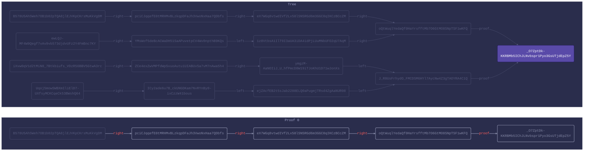

```mermaid
%%{
  init: {
    'flowchart': { 'curve': 'monotoneX' },
    'theme': 'base',
    'themeVariables': {
      'primaryColor': '#2a2d4c',
      'primaryTextColor': '#565a7c',
      'nodeBorder': '#565a7c',
      'edgeLabelBackground': '#2a2d4c',
      'clusterBkg': '#2a2d4c',
      'clusterBorder': '#2a2d4c',
      'lineColor': '#565a7c',
      'fontFamily': 'monospace',
      'darkmode': true
    }
  }
}%%
graph LR
	subgraph Proof 0
		direction LR
		079efc5120214967a1ece0756f4da94d003c8e510954aa422abb0cb8a9158033("B578USAhSWeh7OB1b02pTQA8jlEJVKpCKrsMuKkVgDM") 
		a5c88226aa9e7c4d2d3111ccbc12f392aa4315a261dd5c283711da6bb4036dfb("pciCJqqefE0tMRHMvBLzkqpDFaJh3VwoNxHaa7QDbfs") 
		797ed61aaf2fb7074855fd8bc79f2548d49119dea6dc6182d2a20a0b30427193("eX7WGq8vtwdIVf2Lx58lSNSRGd6m3GGC0qIKCzBCcZM") 
		a10b56baa95879d6907f41da62bb1f7ed31becee86b4c3bc48da53485d702854("oQtWuqlYedaQf0HaYrsfftMb7O6GtMO8SNpTSF1wKFQ") 
		fceed9a6d0e4f8a29104c6f92028492cdbdbb29af53f2a371ac5138dd1296796("_O7ZptDk-KKRBMb5IChJLNvbspr1Pyo3GsUTjdEpZ5Y") 
		079efc5120214967a1ece0756f4da94d003c8e510954aa422abb0cb8a9158033 -- right --> a5c88226aa9e7c4d2d3111ccbc12f392aa4315a261dd5c283711da6bb4036dfb
		a5c88226aa9e7c4d2d3111ccbc12f392aa4315a261dd5c283711da6bb4036dfb -- right --> 797ed61aaf2fb7074855fd8bc79f2548d49119dea6dc6182d2a20a0b30427193
		797ed61aaf2fb7074855fd8bc79f2548d49119dea6dc6182d2a20a0b30427193 -- right --> a10b56baa95879d6907f41da62bb1f7ed31becee86b4c3bc48da53485d702854
		a10b56baa95879d6907f41da62bb1f7ed31becee86b4c3bc48da53485d702854 -- proof --> fceed9a6d0e4f8a29104c6f92028492cdbdbb29af53f2a371ac5138dd1296796
	end

	subgraph Tree
		direction LR
		_O7ZptDk-KKRBMb5IChJLNvbspr1Pyo3GsUTjdEpZ5Y("_O7ZptDk-KKRBMb5IChJLNvbspr1Pyo3GsUTjdEpZ5Y") 
		B578USAhSWeh7OB1b02pTQA8jlEJVKpCKrsMuKkVgDM("B578USAhSWeh7OB1b02pTQA8jlEJVKpCKrsMuKkVgDM") 
		pciCJqqefE0tMRHMvBLzkqpDFaJh3VwoNxHaa7QDbfs("pciCJqqefE0tMRHMvBLzkqpDFaJh3VwoNxHaa7QDbfs") 
		eX7WGq8vtwdIVf2Lx58lSNSRGd6m3GGC0qIKCzBCcZM("eX7WGq8vtwdIVf2Lx58lSNSRGd6m3GGC0qIKCzBCcZM") 
		oQtWuqlYedaQf0HaYrsfftMb7O6GtMO8SNpTSF1wKFQ("oQtWuqlYedaQf0HaYrsfftMb7O6GtMO8SNpTSF1wKFQ") 
		ewLQJ-MF4W9Qegf7vAv9vb573djdvUFz2Y4FmBnc7KY("ewLQJ-MF4W9Qegf7vAv9vb573djdvUFz2Y4FmBnc7KY") 
		YMsWof5deBcACWaDH51SaAPuvetpCV4Wv0npthB9KQs("YMsWof5deBcACWaDH51SaAPuvetpCV4Wv0npthB9KQs") 
		1z8VtbsA1IlT9I3aUA3iDA4idPjLUuMNbUFO2qU7AqM("1z8VtbsA1IlT9I3aUA3iDA4idPjLUuMNbUFO2qU7AqM") 
		iXvw0qV1d2tMiN8_7Btkbiufs_VDzR56BBV5GtwA3rc("iXvw0qV1d2tMiN8_7Btkbiufs_VDzR56BBV5GtwA3rc") 
		ZCe4exZwVMPfdWpSvuoAutu1UIABUvSa7vM7nAwa5h4("ZCe4exZwVMPfdWpSvuoAutu1UIABUvSa7vM7nAwa5h4") 
		ymgzM-AaNOIiJ_U_hfPmcD8W19iTJoKhU1D71wJonXs("ymgzM-AaNOIiJ_U_hfPmcD8W19iTJoKhU1D71wJonXs") 
		J_R8UsFrhydO_FMCDSM6HYl7AycNw4Z3gTAOYRA4C1Q("J_R8UsFrhydO_FMCDSM6HYl7AycNw4Z3gTAOYRA4C1Q") 
		Uqoj5mowSWBXmIliElD7-UXfsyMCKCqeCk53BWshQ64("Uqoj5mowSWBXmIliElD7-UXfsyMCKCqeCk53BWshQ64") 
		ICy2ade6u7B_ckUNGDKam7NvRYnBy0-ixCzzW41bous("ICy2ade6u7B_ckUNGDKam7NvRYnBy0-ixCzzW41bous") 
		ejZAcfEB2t5sJab2288ELQ0aPugmjTRsd4ZgAaNUR08("ejZAcfEB2t5sJab2288ELQ0aPugmjTRsd4ZgAaNUR08") 
		B578USAhSWeh7OB1b02pTQA8jlEJVKpCKrsMuKkVgDM -- right --> pciCJqqefE0tMRHMvBLzkqpDFaJh3VwoNxHaa7QDbfs
		pciCJqqefE0tMRHMvBLzkqpDFaJh3VwoNxHaa7QDbfs -- right --> eX7WGq8vtwdIVf2Lx58lSNSRGd6m3GGC0qIKCzBCcZM
		eX7WGq8vtwdIVf2Lx58lSNSRGd6m3GGC0qIKCzBCcZM -- right --> oQtWuqlYedaQf0HaYrsfftMb7O6GtMO8SNpTSF1wKFQ
		oQtWuqlYedaQf0HaYrsfftMb7O6GtMO8SNpTSF1wKFQ -- proof --> _O7ZptDk-KKRBMb5IChJLNvbspr1Pyo3GsUTjdEpZ5Y
		ewLQJ-MF4W9Qegf7vAv9vb573djdvUFz2Y4FmBnc7KY -- right --> YMsWof5deBcACWaDH51SaAPuvetpCV4Wv0npthB9KQs
		YMsWof5deBcACWaDH51SaAPuvetpCV4Wv0npthB9KQs -- left --> 1z8VtbsA1IlT9I3aUA3iDA4idPjLUuMNbUFO2qU7AqM
		1z8VtbsA1IlT9I3aUA3iDA4idPjLUuMNbUFO2qU7AqM -- right --> oQtWuqlYedaQf0HaYrsfftMb7O6GtMO8SNpTSF1wKFQ
		iXvw0qV1d2tMiN8_7Btkbiufs_VDzR56BBV5GtwA3rc -- right --> ZCe4exZwVMPfdWpSvuoAutu1UIABUvSa7vM7nAwa5h4
		ZCe4exZwVMPfdWpSvuoAutu1UIABUvSa7vM7nAwa5h4 -- right --> ymgzM-AaNOIiJ_U_hfPmcD8W19iTJoKhU1D71wJonXs
		ymgzM-AaNOIiJ_U_hfPmcD8W19iTJoKhU1D71wJonXs -- left --> J_R8UsFrhydO_FMCDSM6HYl7AycNw4Z3gTAOYRA4C1Q
		J_R8UsFrhydO_FMCDSM6HYl7AycNw4Z3gTAOYRA4C1Q -- proof --> _O7ZptDk-KKRBMb5IChJLNvbspr1Pyo3GsUTjdEpZ5Y
		Uqoj5mowSWBXmIliElD7-UXfsyMCKCqeCk53BWshQ64 -- right --> ICy2ade6u7B_ckUNGDKam7NvRYnBy0-ixCzzW41bous
		ICy2ade6u7B_ckUNGDKam7NvRYnBy0-ixCzzW41bous -- left --> ejZAcfEB2t5sJab2288ELQ0aPugmjTRsd4ZgAaNUR08
		ejZAcfEB2t5sJab2288ELQ0aPugmjTRsd4ZgAaNUR08 -- left --> J_R8UsFrhydO_FMCDSM6HYl7AycNw4Z3gTAOYRA4C1Q
	end

%% https://transmute.industries 
%% Leaf Styles 
%% Proof Styles 
linkStyle 0 color: #ff605d, stroke: #8286a3, stroke-width: 2.0px
linkStyle 1 color: #ff605d, stroke: #8286a3, stroke-width: 2.0px
linkStyle 2 color: #ff605d, stroke: #8286a3, stroke-width: 2.0px
linkStyle 3 color: #ff605d, stroke: #8286a3, stroke-width: 2.0px
style a5c88226aa9e7c4d2d3111ccbc12f392aa4315a261dd5c283711da6bb4036dfb color: #8286a3, stroke: #8286a3, stroke-width: 2.0px
style 797ed61aaf2fb7074855fd8bc79f2548d49119dea6dc6182d2a20a0b30427193 color: #8286a3, stroke: #8286a3, stroke-width: 2.0px
style a10b56baa95879d6907f41da62bb1f7ed31becee86b4c3bc48da53485d702854 color: #8286a3, stroke: #8286a3, stroke-width: 2.0px
style fceed9a6d0e4f8a29104c6f92028492cdbdbb29af53f2a371ac5138dd1296796 color: #8286a3, stroke: #8286a3, stroke-width: 2.0px
%% Root Style 
style _O7ZptDk-KKRBMb5IChJLNvbspr1Pyo3GsUTjdEpZ5Y color: #fff, fill: #594aa8, stroke: #27225b, stroke-width: 2.0px
```