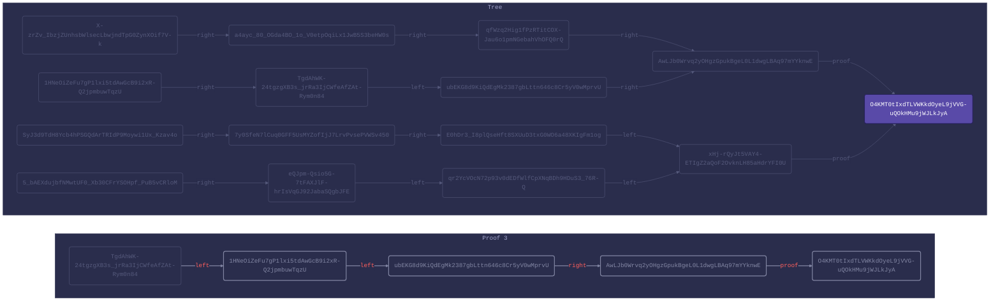

```mermaid
%%{
  init: {
    'flowchart': { 'curve': 'monotoneX' },
    'theme': 'base',
    'themeVariables': {
      'primaryColor': '#2a2d4c',
      'primaryTextColor': '#565a7c',
      'nodeBorder': '#565a7c',
      'edgeLabelBackground': '#2a2d4c',
      'clusterBkg': '#2a2d4c',
      'clusterBorder': '#2a2d4c',
      'lineColor': '#565a7c',
      'fontFamily': 'monospace',
      'darkmode': true
    }
  }
}%%
graph LR
	subgraph Proof 3
		direction LR
		4e07408562bedb8b60ce05c1decfe3ad16b72230967de01f640b7e4729b49fce("TgdAhWK-24tgzgXB3s_jrRa3IjCWfeAfZAt-Rym0n84") 
		d4735e3a265e16eee03f59718b9b5d03019c07d8b6c51f90da3a666eec13ab35("1HNeOiZeFu7gP1lxi5tdAwGcB9i2xR-Q2jpmbuwTqzU") 
		b9b10a1bc77d2a241d120324db7f3b81b2edb67eb8e9cf02af9c95d30329aef5("ubEKG8d9KiQdEgMk2387gbLttn646c8Cr5yV0wMprvU") 
		0302c96f45abbeadb23878331a9ba406078bd0bd5dc202c102af7b9986249f01("AwLJb0Wrvq2yOHgzGpukBgeL0L1dwgLBAq97mYYknwE") 
		3b828c4f4b48c5d4cb5562a474ec9e2fd8d5546fae40e90732ef635892e42720("O4KMT0tIxdTLVWKkdOyeL9jVVG-uQOkHMu9jWJLkJyA") 
		4e07408562bedb8b60ce05c1decfe3ad16b72230967de01f640b7e4729b49fce -- left --> d4735e3a265e16eee03f59718b9b5d03019c07d8b6c51f90da3a666eec13ab35
		d4735e3a265e16eee03f59718b9b5d03019c07d8b6c51f90da3a666eec13ab35 -- left --> b9b10a1bc77d2a241d120324db7f3b81b2edb67eb8e9cf02af9c95d30329aef5
		b9b10a1bc77d2a241d120324db7f3b81b2edb67eb8e9cf02af9c95d30329aef5 -- right --> 0302c96f45abbeadb23878331a9ba406078bd0bd5dc202c102af7b9986249f01
		0302c96f45abbeadb23878331a9ba406078bd0bd5dc202c102af7b9986249f01 -- proof --> 3b828c4f4b48c5d4cb5562a474ec9e2fd8d5546fae40e90732ef635892e42720
	end

	subgraph Tree
		direction LR
		O4KMT0tIxdTLVWKkdOyeL9jVVG-uQOkHMu9jWJLkJyA("O4KMT0tIxdTLVWKkdOyeL9jVVG-uQOkHMu9jWJLkJyA") 
		X-zrZv_IbzjZUnhsbWlsecLbwjndTpG0ZynXOif7V-k("X-zrZv_IbzjZUnhsbWlsecLbwjndTpG0ZynXOif7V-k") 
		a4ayc_80_OGda4BO_1o_V0etpOqiLx1JwB5S3beHW0s("a4ayc_80_OGda4BO_1o_V0etpOqiLx1JwB5S3beHW0s") 
		qfWzq2Hig1fPzRTitCOX-Jau6o1pmNGebahVhOFQ0rQ("qfWzq2Hig1fPzRTitCOX-Jau6o1pmNGebahVhOFQ0rQ") 
		AwLJb0Wrvq2yOHgzGpukBgeL0L1dwgLBAq97mYYknwE("AwLJb0Wrvq2yOHgzGpukBgeL0L1dwgLBAq97mYYknwE") 
		1HNeOiZeFu7gP1lxi5tdAwGcB9i2xR-Q2jpmbuwTqzU("1HNeOiZeFu7gP1lxi5tdAwGcB9i2xR-Q2jpmbuwTqzU") 
		TgdAhWK-24tgzgXB3s_jrRa3IjCWfeAfZAt-Rym0n84("TgdAhWK-24tgzgXB3s_jrRa3IjCWfeAfZAt-Rym0n84") 
		ubEKG8d9KiQdEgMk2387gbLttn646c8Cr5yV0wMprvU("ubEKG8d9KiQdEgMk2387gbLttn646c8Cr5yV0wMprvU") 
		SyJ3d9TdH8Ycb4hPSGQdArTRIdP9Moywi1Ux_Kzav4o("SyJ3d9TdH8Ycb4hPSGQdArTRIdP9Moywi1Ux_Kzav4o") 
		7y0SfeN7lCuq0GFF5UsMYZofIjJ7LrvPvsePVWSv450("7y0SfeN7lCuq0GFF5UsMYZofIjJ7LrvPvsePVWSv450") 
		E0hDr3_I8plQseHft8SXUuD3txG0WO6a48XKIgFm1og("E0hDr3_I8plQseHft8SXUuD3txG0WO6a48XKIgFm1og") 
		xHj-rQyJt5VAY4-ETIgZ2aQoF2OvknLH85aHdrYFI0U("xHj-rQyJt5VAY4-ETIgZ2aQoF2OvknLH85aHdrYFI0U") 
		5_bAEXdujbfNMwtUF0_Xb30CFrYSOHpf_PuB5vCRloM("5_bAEXdujbfNMwtUF0_Xb30CFrYSOHpf_PuB5vCRloM") 
		eQJpm-Qsio5G-7tFAXJlF-hrIsVqGJ92JabaSQgbJFE("eQJpm-Qsio5G-7tFAXJlF-hrIsVqGJ92JabaSQgbJFE") 
		qr2YcVOcN72p93v0dEDfWlfCpXNqBDh9HDuS3_76R-Q("qr2YcVOcN72p93v0dEDfWlfCpXNqBDh9HDuS3_76R-Q") 
		X-zrZv_IbzjZUnhsbWlsecLbwjndTpG0ZynXOif7V-k -- right --> a4ayc_80_OGda4BO_1o_V0etpOqiLx1JwB5S3beHW0s
		a4ayc_80_OGda4BO_1o_V0etpOqiLx1JwB5S3beHW0s -- right --> qfWzq2Hig1fPzRTitCOX-Jau6o1pmNGebahVhOFQ0rQ
		qfWzq2Hig1fPzRTitCOX-Jau6o1pmNGebahVhOFQ0rQ -- right --> AwLJb0Wrvq2yOHgzGpukBgeL0L1dwgLBAq97mYYknwE
		AwLJb0Wrvq2yOHgzGpukBgeL0L1dwgLBAq97mYYknwE -- proof --> O4KMT0tIxdTLVWKkdOyeL9jVVG-uQOkHMu9jWJLkJyA
		1HNeOiZeFu7gP1lxi5tdAwGcB9i2xR-Q2jpmbuwTqzU -- right --> TgdAhWK-24tgzgXB3s_jrRa3IjCWfeAfZAt-Rym0n84
		TgdAhWK-24tgzgXB3s_jrRa3IjCWfeAfZAt-Rym0n84 -- left --> ubEKG8d9KiQdEgMk2387gbLttn646c8Cr5yV0wMprvU
		ubEKG8d9KiQdEgMk2387gbLttn646c8Cr5yV0wMprvU -- right --> AwLJb0Wrvq2yOHgzGpukBgeL0L1dwgLBAq97mYYknwE
		SyJ3d9TdH8Ycb4hPSGQdArTRIdP9Moywi1Ux_Kzav4o -- right --> 7y0SfeN7lCuq0GFF5UsMYZofIjJ7LrvPvsePVWSv450
		7y0SfeN7lCuq0GFF5UsMYZofIjJ7LrvPvsePVWSv450 -- right --> E0hDr3_I8plQseHft8SXUuD3txG0WO6a48XKIgFm1og
		E0hDr3_I8plQseHft8SXUuD3txG0WO6a48XKIgFm1og -- left --> xHj-rQyJt5VAY4-ETIgZ2aQoF2OvknLH85aHdrYFI0U
		xHj-rQyJt5VAY4-ETIgZ2aQoF2OvknLH85aHdrYFI0U -- proof --> O4KMT0tIxdTLVWKkdOyeL9jVVG-uQOkHMu9jWJLkJyA
		5_bAEXdujbfNMwtUF0_Xb30CFrYSOHpf_PuB5vCRloM -- right --> eQJpm-Qsio5G-7tFAXJlF-hrIsVqGJ92JabaSQgbJFE
		eQJpm-Qsio5G-7tFAXJlF-hrIsVqGJ92JabaSQgbJFE -- left --> qr2YcVOcN72p93v0dEDfWlfCpXNqBDh9HDuS3_76R-Q
		qr2YcVOcN72p93v0dEDfWlfCpXNqBDh9HDuS3_76R-Q -- left --> xHj-rQyJt5VAY4-ETIgZ2aQoF2OvknLH85aHdrYFI0U
	end

%% https://transmute.industries 
%% Leaf Styles 
%% Proof Styles 
linkStyle 0 color: #ff605d, stroke: #8286a3, stroke-width: 2.0px
linkStyle 1 color: #ff605d, stroke: #8286a3, stroke-width: 2.0px
linkStyle 2 color: #ff605d, stroke: #8286a3, stroke-width: 2.0px
linkStyle 3 color: #ff605d, stroke: #8286a3, stroke-width: 2.0px
style d4735e3a265e16eee03f59718b9b5d03019c07d8b6c51f90da3a666eec13ab35 color: #8286a3, stroke: #8286a3, stroke-width: 2.0px
style b9b10a1bc77d2a241d120324db7f3b81b2edb67eb8e9cf02af9c95d30329aef5 color: #8286a3, stroke: #8286a3, stroke-width: 2.0px
style 0302c96f45abbeadb23878331a9ba406078bd0bd5dc202c102af7b9986249f01 color: #8286a3, stroke: #8286a3, stroke-width: 2.0px
style 3b828c4f4b48c5d4cb5562a474ec9e2fd8d5546fae40e90732ef635892e42720 color: #8286a3, stroke: #8286a3, stroke-width: 2.0px
%% Root Style 
style O4KMT0tIxdTLVWKkdOyeL9jVVG-uQOkHMu9jWJLkJyA color: #fff, fill: #594aa8, stroke: #27225b, stroke-width: 2.0px
```