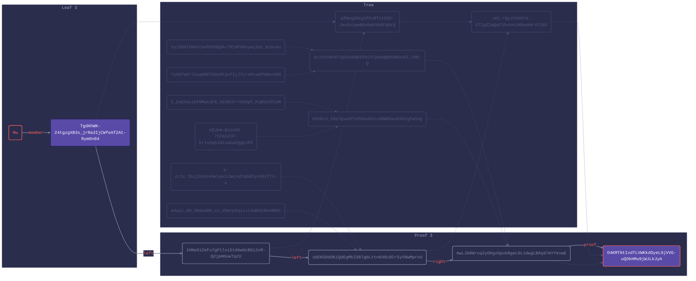

```mermaid
%%{
  init: {
    'flowchart': { 'curve': 'monotoneX' },
    'theme': 'base',
    'themeVariables': {
      'primaryColor': '#2a2d4c',
      'primaryTextColor': '#565a7c',
      'nodeBorder': '#565a7c',
      'edgeLabelBackground': '#2a2d4c',
      'clusterBkg': '#2a2d4c',
      'clusterBorder': '#2a2d4c',
      'lineColor': '#565a7c',
      'fontFamily': 'monospace',
      'darkmode': true
    }
  }
}%%
graph LR
	subgraph Leaf 3
		direction LR
		4e07408562bedb8b60ce05c1decfe3ad16b72230967de01f640b7e4729b49fce("TgdAhWK-24tgzgXB3s_jrRa3IjCWfeAfZAt-Rym0n84") 
		33("Mw") 
		33 -- member --> 4e07408562bedb8b60ce05c1decfe3ad16b72230967de01f640b7e4729b49fce
	end

	subgraph Proof 3
		direction LR
		4e07408562bedb8b60ce05c1decfe3ad16b72230967de01f640b7e4729b49fce("TgdAhWK-24tgzgXB3s_jrRa3IjCWfeAfZAt-Rym0n84") 
		d4735e3a265e16eee03f59718b9b5d03019c07d8b6c51f90da3a666eec13ab35("1HNeOiZeFu7gP1lxi5tdAwGcB9i2xR-Q2jpmbuwTqzU") 
		b9b10a1bc77d2a241d120324db7f3b81b2edb67eb8e9cf02af9c95d30329aef5("ubEKG8d9KiQdEgMk2387gbLttn646c8Cr5yV0wMprvU") 
		0302c96f45abbeadb23878331a9ba406078bd0bd5dc202c102af7b9986249f01("AwLJb0Wrvq2yOHgzGpukBgeL0L1dwgLBAq97mYYknwE") 
		3b828c4f4b48c5d4cb5562a474ec9e2fd8d5546fae40e90732ef635892e42720("O4KMT0tIxdTLVWKkdOyeL9jVVG-uQOkHMu9jWJLkJyA") 
		4e07408562bedb8b60ce05c1decfe3ad16b72230967de01f640b7e4729b49fce -- left --> d4735e3a265e16eee03f59718b9b5d03019c07d8b6c51f90da3a666eec13ab35
		d4735e3a265e16eee03f59718b9b5d03019c07d8b6c51f90da3a666eec13ab35 -- left --> b9b10a1bc77d2a241d120324db7f3b81b2edb67eb8e9cf02af9c95d30329aef5
		b9b10a1bc77d2a241d120324db7f3b81b2edb67eb8e9cf02af9c95d30329aef5 -- right --> 0302c96f45abbeadb23878331a9ba406078bd0bd5dc202c102af7b9986249f01
		0302c96f45abbeadb23878331a9ba406078bd0bd5dc202c102af7b9986249f01 -- proof --> 3b828c4f4b48c5d4cb5562a474ec9e2fd8d5546fae40e90732ef635892e42720
	end

	subgraph Tree
		direction LR
		3b828c4f4b48c5d4cb5562a474ec9e2fd8d5546fae40e90732ef635892e42720("O4KMT0tIxdTLVWKkdOyeL9jVVG-uQOkHMu9jWJLkJyA") 
		c478fead0c89b79540638f844c8819d9a4281763af9272c7f3968776b6052345("xHj-rQyJt5VAY4-ETIgZ2aQoF2OvknLH85aHdrYFI0U") 
		0302c96f45abbeadb23878331a9ba406078bd0bd5dc202c102af7b9986249f01("AwLJb0Wrvq2yOHgzGpukBgeL0L1dwgLBAq97mYYknwE") 
		b9b10a1bc77d2a241d120324db7f3b81b2edb67eb8e9cf02af9c95d30329aef5("ubEKG8d9KiQdEgMk2387gbLttn646c8Cr5yV0wMprvU") 
		a9f5b3ab61e28357cfcd14e2b42397f896aeea8d6998d19e6da85584e150d2b4("qfWzq2Hig1fPzRTitCOX-Jau6o1pmNGebahVhOFQ0rQ") 
		aabd9871539c37bda9f77bf47440df5a57c2a5736a04387d1c3b92dffefa47e4("qr2YcVOcN72p93v0dEDfWlfCpXNqBDh9HDuS3_76R-Q") 
		134843af7fc8f29950b1e1dfb7c49752e0f7b711b458ee9ae3c5ca220166d688("E0hDr3_I8plQseHft8SXUuD3txG0WO6a48XKIgFm1og") 
		5feceb66ffc86f38d952786c6d696c79c2dbc239dd4e91b46729d73a27fb57e9("X-zrZv_IbzjZUnhsbWlsecLbwjndTpG0ZynXOif7V-k") 
		6b86b273ff34fce19d6b804eff5a3f5747ada4eaa22f1d49c01e52ddb7875b4b("a4ayc_80_OGda4BO_1o_V0etpOqiLx1JwB5S3beHW0s") 
		d4735e3a265e16eee03f59718b9b5d03019c07d8b6c51f90da3a666eec13ab35("1HNeOiZeFu7gP1lxi5tdAwGcB9i2xR-Q2jpmbuwTqzU") 
		4e07408562bedb8b60ce05c1decfe3ad16b72230967de01f640b7e4729b49fce("TgdAhWK-24tgzgXB3s_jrRa3IjCWfeAfZAt-Rym0n84") 
		4b227777d4dd1fc61c6f884f48641d02b4d121d3fd328cb08b5531fcacdabf8a("SyJ3d9TdH8Ycb4hPSGQdArTRIdP9Moywi1Ux_Kzav4o") 
		ef2d127de37b942baad06145e54b0c619a1f22327b2ebbcfbec78f5564afe39d("7y0SfeN7lCuq0GFF5UsMYZofIjJ7LrvPvsePVWSv450") 
		e7f6c011776e8db7cd330b54174fd76f7d0216b612387a5ffcfb81e6f0919683("5_bAEXdujbfNMwtUF0_Xb30CFrYSOHpf_PuB5vCRloM") 
		7902699be42c8a8e46fbbb4501726517e86b22c56a189f7625a6da49081b2451("eQJpm-Qsio5G-7tFAXJlF-hrIsVqGJ92JabaSQgbJFE") 
		c478fead0c89b79540638f844c8819d9a4281763af9272c7f3968776b6052345 -.-> 3b828c4f4b48c5d4cb5562a474ec9e2fd8d5546fae40e90732ef635892e42720
		0302c96f45abbeadb23878331a9ba406078bd0bd5dc202c102af7b9986249f01 -.-> 3b828c4f4b48c5d4cb5562a474ec9e2fd8d5546fae40e90732ef635892e42720
		b9b10a1bc77d2a241d120324db7f3b81b2edb67eb8e9cf02af9c95d30329aef5 -.-> c478fead0c89b79540638f844c8819d9a4281763af9272c7f3968776b6052345
		a9f5b3ab61e28357cfcd14e2b42397f896aeea8d6998d19e6da85584e150d2b4 -.-> c478fead0c89b79540638f844c8819d9a4281763af9272c7f3968776b6052345
		aabd9871539c37bda9f77bf47440df5a57c2a5736a04387d1c3b92dffefa47e4 -.-> 0302c96f45abbeadb23878331a9ba406078bd0bd5dc202c102af7b9986249f01
		134843af7fc8f29950b1e1dfb7c49752e0f7b711b458ee9ae3c5ca220166d688 -.-> 0302c96f45abbeadb23878331a9ba406078bd0bd5dc202c102af7b9986249f01
		5feceb66ffc86f38d952786c6d696c79c2dbc239dd4e91b46729d73a27fb57e9 -.-> b9b10a1bc77d2a241d120324db7f3b81b2edb67eb8e9cf02af9c95d30329aef5
		6b86b273ff34fce19d6b804eff5a3f5747ada4eaa22f1d49c01e52ddb7875b4b -.-> b9b10a1bc77d2a241d120324db7f3b81b2edb67eb8e9cf02af9c95d30329aef5
		d4735e3a265e16eee03f59718b9b5d03019c07d8b6c51f90da3a666eec13ab35 -.-> a9f5b3ab61e28357cfcd14e2b42397f896aeea8d6998d19e6da85584e150d2b4
		4e07408562bedb8b60ce05c1decfe3ad16b72230967de01f640b7e4729b49fce -.-> a9f5b3ab61e28357cfcd14e2b42397f896aeea8d6998d19e6da85584e150d2b4
		4b227777d4dd1fc61c6f884f48641d02b4d121d3fd328cb08b5531fcacdabf8a -.-> aabd9871539c37bda9f77bf47440df5a57c2a5736a04387d1c3b92dffefa47e4
		ef2d127de37b942baad06145e54b0c619a1f22327b2ebbcfbec78f5564afe39d -.-> aabd9871539c37bda9f77bf47440df5a57c2a5736a04387d1c3b92dffefa47e4
		e7f6c011776e8db7cd330b54174fd76f7d0216b612387a5ffcfb81e6f0919683 -.-> 134843af7fc8f29950b1e1dfb7c49752e0f7b711b458ee9ae3c5ca220166d688
		7902699be42c8a8e46fbbb4501726517e86b22c56a189f7625a6da49081b2451 -.-> 134843af7fc8f29950b1e1dfb7c49752e0f7b711b458ee9ae3c5ca220166d688
	end

%% https://transmute.industries 
%% Leaf Styles 
style 4e07408562bedb8b60ce05c1decfe3ad16b72230967de01f640b7e4729b49fce color: #fff, fill: #594aa8, stroke: #27225b, stroke-width: 2.0px
style 33 color: #ff605d, stroke: #ff605d, stroke-width: 2.0px
linkStyle 0 color: #ff605d, stroke: #8286a3, stroke-width: 2.0px
%% Proof Styles 
linkStyle 1 color: #ff605d, stroke: #8286a3, stroke-width: 2.0px
linkStyle 2 color: #ff605d, stroke: #8286a3, stroke-width: 2.0px
linkStyle 3 color: #ff605d, stroke: #8286a3, stroke-width: 2.0px
linkStyle 4 color: #ff605d, stroke: #8286a3, stroke-width: 2.0px
style d4735e3a265e16eee03f59718b9b5d03019c07d8b6c51f90da3a666eec13ab35 color: #8286a3, stroke: #8286a3, stroke-width: 2.0px
style b9b10a1bc77d2a241d120324db7f3b81b2edb67eb8e9cf02af9c95d30329aef5 color: #8286a3, stroke: #8286a3, stroke-width: 2.0px
style 0302c96f45abbeadb23878331a9ba406078bd0bd5dc202c102af7b9986249f01 color: #8286a3, stroke: #8286a3, stroke-width: 2.0px
style 3b828c4f4b48c5d4cb5562a474ec9e2fd8d5546fae40e90732ef635892e42720 color: #8286a3, stroke: #8286a3, stroke-width: 2.0px
%% Root Style 
style 3b828c4f4b48c5d4cb5562a474ec9e2fd8d5546fae40e90732ef635892e42720 color: #fff, fill: #594aa8, stroke: #ff605d, stroke-width: 2.0px
```