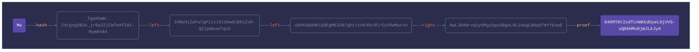

```mermaid
%%{
  init: {
    'flowchart': { 'curve': 'monotoneX' },
    'theme': 'base',
    'themeVariables': {
      'primaryColor': '#2a2d4c',
      'primaryTextColor': '#565a7c',
      'nodeBorder': '#565a7c',
      'edgeLabelBackground': '#2a2d4c',
      'clusterBkg': '#2a2d4c',
      'clusterBorder': '#2a2d4c',
      'lineColor': '#565a7c',
      'fontFamily': 'monospace',
      'darkmode': true
    }
  }
}%%
graph LR
linkStyle default fill:none, stroke-width: 1px, stroke: #565a7c
  subgraph &nbsp;
    direction LR
		O4KMT0tIxdTLVWKkdOyeL9jVVG-uQOkHMu9jWJLkJyA(O4KMT0tIxdTLVWKkdOyeL9jVVG-uQOkHMu9jWJLkJyA) 
		style O4KMT0tIxdTLVWKkdOyeL9jVVG-uQOkHMu9jWJLkJyA color:#f5f7fd, fill:#594aa8, stroke:#27225b, stroke-width: 2.0px 
		Mw(Mw) 
		style Mw color:#f5f7fd, fill:#594aa8, stroke:#27225b, stroke-width: 2.0px 
		TgdAhWK-24tgzgXB3s_jrRa3IjCWfeAfZAt-Rym0n84(TgdAhWK-24tgzgXB3s_jrRa3IjCWfeAfZAt-Rym0n84) 
		style TgdAhWK-24tgzgXB3s_jrRa3IjCWfeAfZAt-Rym0n84 color:#8286a3, stroke:#8286a3, stroke-width: 1.0px 
		1HNeOiZeFu7gP1lxi5tdAwGcB9i2xR-Q2jpmbuwTqzU(1HNeOiZeFu7gP1lxi5tdAwGcB9i2xR-Q2jpmbuwTqzU) 
		style 1HNeOiZeFu7gP1lxi5tdAwGcB9i2xR-Q2jpmbuwTqzU color:#8286a3, stroke:#8286a3, stroke-width: 1.0px 
		ubEKG8d9KiQdEgMk2387gbLttn646c8Cr5yV0wMprvU(ubEKG8d9KiQdEgMk2387gbLttn646c8Cr5yV0wMprvU) 
		style ubEKG8d9KiQdEgMk2387gbLttn646c8Cr5yV0wMprvU color:#8286a3, stroke:#8286a3, stroke-width: 1.0px 
		AwLJb0Wrvq2yOHgzGpukBgeL0L1dwgLBAq97mYYknwE(AwLJb0Wrvq2yOHgzGpukBgeL0L1dwgLBAq97mYYknwE) 
		style AwLJb0Wrvq2yOHgzGpukBgeL0L1dwgLBAq97mYYknwE color:#8286a3, stroke:#8286a3, stroke-width: 1.0px 
		Mw -- hash --> TgdAhWK-24tgzgXB3s_jrRa3IjCWfeAfZAt-Rym0n84 
		linkStyle 0 color:#fcb373, stroke-width: 2.0px 
		TgdAhWK-24tgzgXB3s_jrRa3IjCWfeAfZAt-Rym0n84 -- left --> 1HNeOiZeFu7gP1lxi5tdAwGcB9i2xR-Q2jpmbuwTqzU 
		linkStyle 1 color:#ff605d, stroke-width: 2.0px 
		1HNeOiZeFu7gP1lxi5tdAwGcB9i2xR-Q2jpmbuwTqzU -- left --> ubEKG8d9KiQdEgMk2387gbLttn646c8Cr5yV0wMprvU 
		linkStyle 2 color:#ff605d, stroke-width: 2.0px 
		ubEKG8d9KiQdEgMk2387gbLttn646c8Cr5yV0wMprvU -- right --> AwLJb0Wrvq2yOHgzGpukBgeL0L1dwgLBAq97mYYknwE 
		linkStyle 3 color:#ff605d, stroke-width: 2.0px 
		AwLJb0Wrvq2yOHgzGpukBgeL0L1dwgLBAq97mYYknwE -- proof --> O4KMT0tIxdTLVWKkdOyeL9jVVG-uQOkHMu9jWJLkJyA 
		linkStyle 4 color:#fcb373, stroke-width: 2.0px 
  end
```
