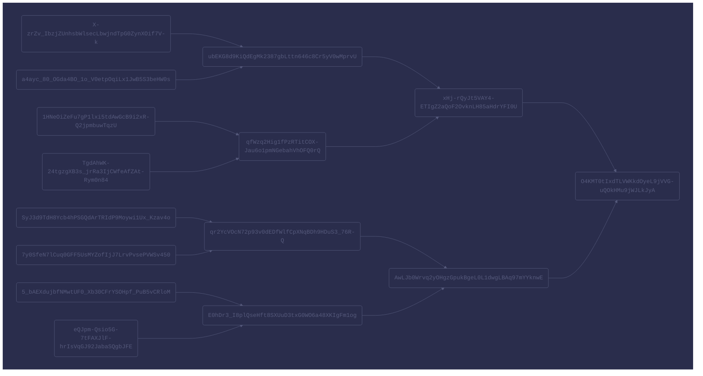

```mermaid
%%{
  init: {
    'flowchart': { 'curve': 'monotoneX' },
    'theme': 'base',
    'themeVariables': {
      'primaryColor': '#2a2d4c',
      'primaryTextColor': '#565a7c',
      'nodeBorder': '#565a7c',
      'edgeLabelBackground': '#2a2d4c',
      'clusterBkg': '#2a2d4c',
      'clusterBorder': '#2a2d4c',
      'lineColor': '#565a7c',
      'fontFamily': 'monospace',
      'darkmode': true
    }
  }
}%%
graph LR
linkStyle default fill:none, stroke-width: 1px, stroke: #565a7c
  subgraph &nbsp;
    direction LR
		O4KMT0tIxdTLVWKkdOyeL9jVVG-uQOkHMu9jWJLkJyA(O4KMT0tIxdTLVWKkdOyeL9jVVG-uQOkHMu9jWJLkJyA) 
		style O4KMT0tIxdTLVWKkdOyeL9jVVG-uQOkHMu9jWJLkJyA stroke:#565a7c, stroke-width: 1.0px 
		xHj-rQyJt5VAY4-ETIgZ2aQoF2OvknLH85aHdrYFI0U(xHj-rQyJt5VAY4-ETIgZ2aQoF2OvknLH85aHdrYFI0U) 
		style xHj-rQyJt5VAY4-ETIgZ2aQoF2OvknLH85aHdrYFI0U stroke:#565a7c, stroke-width: 1.0px 
		AwLJb0Wrvq2yOHgzGpukBgeL0L1dwgLBAq97mYYknwE(AwLJb0Wrvq2yOHgzGpukBgeL0L1dwgLBAq97mYYknwE) 
		style AwLJb0Wrvq2yOHgzGpukBgeL0L1dwgLBAq97mYYknwE stroke:#565a7c, stroke-width: 1.0px 
		ubEKG8d9KiQdEgMk2387gbLttn646c8Cr5yV0wMprvU(ubEKG8d9KiQdEgMk2387gbLttn646c8Cr5yV0wMprvU) 
		style ubEKG8d9KiQdEgMk2387gbLttn646c8Cr5yV0wMprvU stroke:#565a7c, stroke-width: 1.0px 
		qfWzq2Hig1fPzRTitCOX-Jau6o1pmNGebahVhOFQ0rQ(qfWzq2Hig1fPzRTitCOX-Jau6o1pmNGebahVhOFQ0rQ) 
		style qfWzq2Hig1fPzRTitCOX-Jau6o1pmNGebahVhOFQ0rQ stroke:#565a7c, stroke-width: 1.0px 
		qr2YcVOcN72p93v0dEDfWlfCpXNqBDh9HDuS3_76R-Q(qr2YcVOcN72p93v0dEDfWlfCpXNqBDh9HDuS3_76R-Q) 
		style qr2YcVOcN72p93v0dEDfWlfCpXNqBDh9HDuS3_76R-Q stroke:#565a7c, stroke-width: 1.0px 
		E0hDr3_I8plQseHft8SXUuD3txG0WO6a48XKIgFm1og(E0hDr3_I8plQseHft8SXUuD3txG0WO6a48XKIgFm1og) 
		style E0hDr3_I8plQseHft8SXUuD3txG0WO6a48XKIgFm1og stroke:#565a7c, stroke-width: 1.0px 
		X-zrZv_IbzjZUnhsbWlsecLbwjndTpG0ZynXOif7V-k(X-zrZv_IbzjZUnhsbWlsecLbwjndTpG0ZynXOif7V-k) 
		style X-zrZv_IbzjZUnhsbWlsecLbwjndTpG0ZynXOif7V-k stroke:#565a7c, stroke-width: 1.0px 
		a4ayc_80_OGda4BO_1o_V0etpOqiLx1JwB5S3beHW0s(a4ayc_80_OGda4BO_1o_V0etpOqiLx1JwB5S3beHW0s) 
		style a4ayc_80_OGda4BO_1o_V0etpOqiLx1JwB5S3beHW0s stroke:#565a7c, stroke-width: 1.0px 
		1HNeOiZeFu7gP1lxi5tdAwGcB9i2xR-Q2jpmbuwTqzU(1HNeOiZeFu7gP1lxi5tdAwGcB9i2xR-Q2jpmbuwTqzU) 
		style 1HNeOiZeFu7gP1lxi5tdAwGcB9i2xR-Q2jpmbuwTqzU stroke:#565a7c, stroke-width: 1.0px 
		TgdAhWK-24tgzgXB3s_jrRa3IjCWfeAfZAt-Rym0n84(TgdAhWK-24tgzgXB3s_jrRa3IjCWfeAfZAt-Rym0n84) 
		style TgdAhWK-24tgzgXB3s_jrRa3IjCWfeAfZAt-Rym0n84 stroke:#565a7c, stroke-width: 1.0px 
		SyJ3d9TdH8Ycb4hPSGQdArTRIdP9Moywi1Ux_Kzav4o(SyJ3d9TdH8Ycb4hPSGQdArTRIdP9Moywi1Ux_Kzav4o) 
		style SyJ3d9TdH8Ycb4hPSGQdArTRIdP9Moywi1Ux_Kzav4o stroke:#565a7c, stroke-width: 1.0px 
		7y0SfeN7lCuq0GFF5UsMYZofIjJ7LrvPvsePVWSv450(7y0SfeN7lCuq0GFF5UsMYZofIjJ7LrvPvsePVWSv450) 
		style 7y0SfeN7lCuq0GFF5UsMYZofIjJ7LrvPvsePVWSv450 stroke:#565a7c, stroke-width: 1.0px 
		5_bAEXdujbfNMwtUF0_Xb30CFrYSOHpf_PuB5vCRloM(5_bAEXdujbfNMwtUF0_Xb30CFrYSOHpf_PuB5vCRloM) 
		style 5_bAEXdujbfNMwtUF0_Xb30CFrYSOHpf_PuB5vCRloM stroke:#565a7c, stroke-width: 1.0px 
		eQJpm-Qsio5G-7tFAXJlF-hrIsVqGJ92JabaSQgbJFE(eQJpm-Qsio5G-7tFAXJlF-hrIsVqGJ92JabaSQgbJFE) 
		style eQJpm-Qsio5G-7tFAXJlF-hrIsVqGJ92JabaSQgbJFE stroke:#565a7c, stroke-width: 1.0px 
		xHj-rQyJt5VAY4-ETIgZ2aQoF2OvknLH85aHdrYFI0U --> O4KMT0tIxdTLVWKkdOyeL9jVVG-uQOkHMu9jWJLkJyA 
		linkStyle 0 color:#565a7c, stroke:#565a7c, stroke-width: 1.0px 
		AwLJb0Wrvq2yOHgzGpukBgeL0L1dwgLBAq97mYYknwE --> O4KMT0tIxdTLVWKkdOyeL9jVVG-uQOkHMu9jWJLkJyA 
		linkStyle 1 color:#565a7c, stroke:#565a7c, stroke-width: 1.0px 
		ubEKG8d9KiQdEgMk2387gbLttn646c8Cr5yV0wMprvU --> xHj-rQyJt5VAY4-ETIgZ2aQoF2OvknLH85aHdrYFI0U 
		linkStyle 2 color:#565a7c, stroke:#565a7c, stroke-width: 1.0px 
		qfWzq2Hig1fPzRTitCOX-Jau6o1pmNGebahVhOFQ0rQ --> xHj-rQyJt5VAY4-ETIgZ2aQoF2OvknLH85aHdrYFI0U 
		linkStyle 3 color:#565a7c, stroke:#565a7c, stroke-width: 1.0px 
		qr2YcVOcN72p93v0dEDfWlfCpXNqBDh9HDuS3_76R-Q --> AwLJb0Wrvq2yOHgzGpukBgeL0L1dwgLBAq97mYYknwE 
		linkStyle 4 color:#565a7c, stroke:#565a7c, stroke-width: 1.0px 
		E0hDr3_I8plQseHft8SXUuD3txG0WO6a48XKIgFm1og --> AwLJb0Wrvq2yOHgzGpukBgeL0L1dwgLBAq97mYYknwE 
		linkStyle 5 color:#565a7c, stroke:#565a7c, stroke-width: 1.0px 
		X-zrZv_IbzjZUnhsbWlsecLbwjndTpG0ZynXOif7V-k --> ubEKG8d9KiQdEgMk2387gbLttn646c8Cr5yV0wMprvU 
		linkStyle 6 color:#565a7c, stroke:#565a7c, stroke-width: 1.0px 
		a4ayc_80_OGda4BO_1o_V0etpOqiLx1JwB5S3beHW0s --> ubEKG8d9KiQdEgMk2387gbLttn646c8Cr5yV0wMprvU 
		linkStyle 7 color:#565a7c, stroke:#565a7c, stroke-width: 1.0px 
		1HNeOiZeFu7gP1lxi5tdAwGcB9i2xR-Q2jpmbuwTqzU --> qfWzq2Hig1fPzRTitCOX-Jau6o1pmNGebahVhOFQ0rQ 
		linkStyle 8 color:#565a7c, stroke:#565a7c, stroke-width: 1.0px 
		TgdAhWK-24tgzgXB3s_jrRa3IjCWfeAfZAt-Rym0n84 --> qfWzq2Hig1fPzRTitCOX-Jau6o1pmNGebahVhOFQ0rQ 
		linkStyle 9 color:#565a7c, stroke:#565a7c, stroke-width: 1.0px 
		SyJ3d9TdH8Ycb4hPSGQdArTRIdP9Moywi1Ux_Kzav4o --> qr2YcVOcN72p93v0dEDfWlfCpXNqBDh9HDuS3_76R-Q 
		linkStyle 10 color:#565a7c, stroke:#565a7c, stroke-width: 1.0px 
		7y0SfeN7lCuq0GFF5UsMYZofIjJ7LrvPvsePVWSv450 --> qr2YcVOcN72p93v0dEDfWlfCpXNqBDh9HDuS3_76R-Q 
		linkStyle 11 color:#565a7c, stroke:#565a7c, stroke-width: 1.0px 
		5_bAEXdujbfNMwtUF0_Xb30CFrYSOHpf_PuB5vCRloM --> E0hDr3_I8plQseHft8SXUuD3txG0WO6a48XKIgFm1og 
		linkStyle 12 color:#565a7c, stroke:#565a7c, stroke-width: 1.0px 
		eQJpm-Qsio5G-7tFAXJlF-hrIsVqGJ92JabaSQgbJFE --> E0hDr3_I8plQseHft8SXUuD3txG0WO6a48XKIgFm1og 
		linkStyle 13 color:#565a7c, stroke:#565a7c, stroke-width: 1.0px 
  end
```
